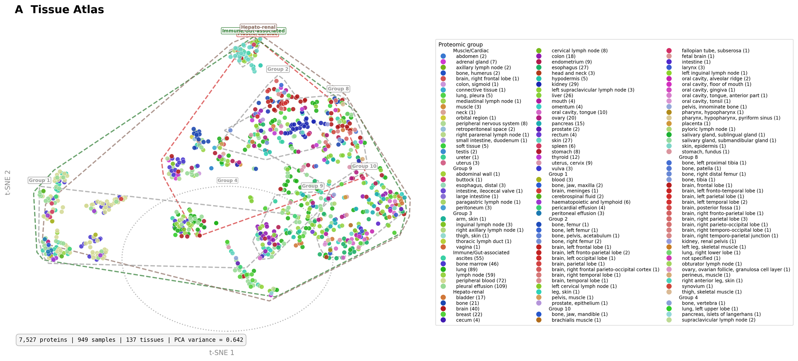
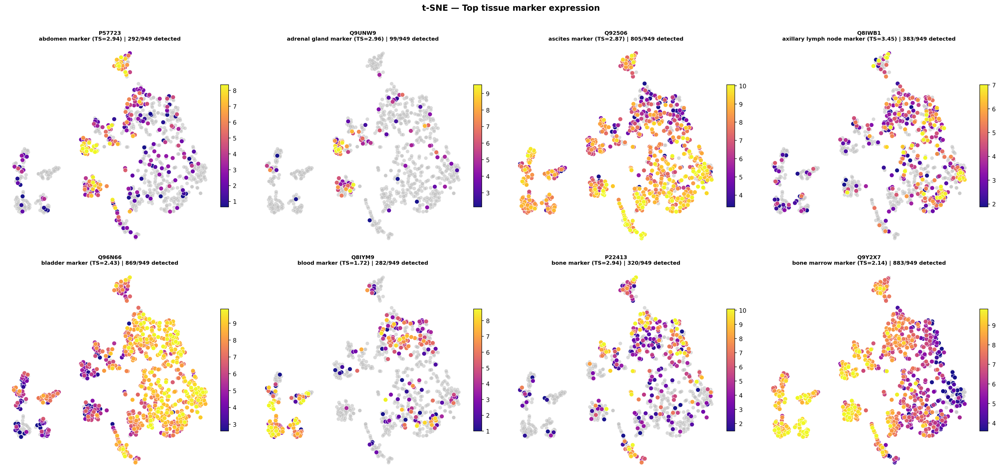
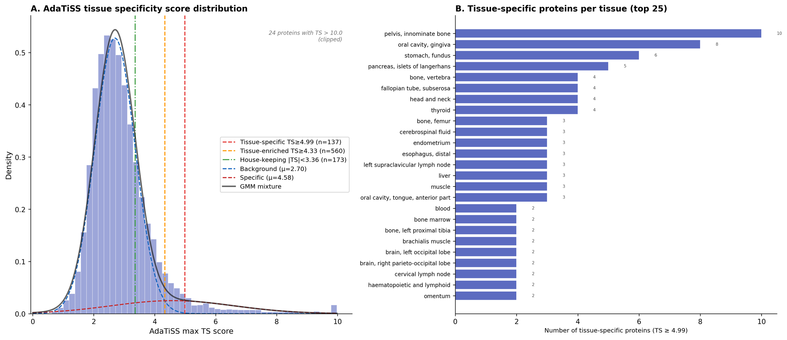

# mokume

[](https://github.com/bigbio/mokume/actions/workflows/python-app.yml)
[](https://github.com/bigbio/mokume/actions/workflows/python-publish.yml)
[](https://badge.fury.io/py/mokume)


**mokume** is a comprehensive proteomics quantification toolkit: it turns
peptide-level mass-spectrometry intensities into protein expression matrices,
with built-in normalization, imputation, batch correction, and differential
expression. It supports iBAQ, TopN, MaxLFQ, and DirectLFQ quantification, is
designed for the [quantms](https://github.com/bigbio/quantms) ecosystem, and
can be used as either a Python library or a standalone command-line tool.

mokume is an evolution of [ibaqpy](https://github.com/bigbio/ibaqpy), extended
well beyond iBAQ to a broader range of quantification, normalization, and
differential-expression methods.

## Why "mokume"?

*[Mokume-gane](https://en.wikipedia.org/wiki/Mokume-gane)* (木目金, "wood-grain
metal") is a Japanese metalworking technique that fuses layers of different
metals into a single piece with a distinctive flowing pattern. mokume does the
same with proteomics data: it melds many noisy, overlapping peptide intensities
into one coherent protein expression profile.

## Repository layout

This repository ships **two implementations of mokume in one place**, following
the multi-language monorepo convention used by projects such as
[Apache Arrow](https://github.com/apache/arrow) (one top-level folder per
language):

```text
mokume/
├── docs/      # one shared documentation site (mkdocs)
├── python/    # the pure-Python implementation — the `mokume` package
└── rust/      # a Rust compute kernel: a standalone CLI binary + a maturin wheel
```

- **`rust/`** — the Rust compute kernel: the **leading implementation** of the
  native computation commands, shipped as a standalone CLI binary and an
  in-process `mokume._mokume` wheel.
- **`python/`** — the pure-Python `mokume` package (`pip install mokume`).
  Added value: readable implementations of overlapping methods that are easy to
  extend and script against, plus compatibility baselines for covered kernel
  behavior.

Both expose the same four computation command names, with different support
levels. **mokume is Rust-first**: new computation lands in the Rust kernel, and
overlapping supported paths are parity-tested where coverage exists. See
[Maintenance scope](#maintenance-scope) below.

## Installation

The Python package is the recommended way to get started:

```bash
pip install mokume
```

The base install is lightweight and covers the **core LFQ workflow** — MaxLFQ,
Top3/TopN, feature/peptide normalization, and parquet/SDRF I/O. Features that pull
heavier dependencies are opt-in via extras (each raises a clear install hint if
used without it):

```bash
pip install "mokume[ibaq]"        # FASTA digestion + iBAQ / piBAQ / TPA absolute quant
pip install "mokume[analysis]"    # differential expression, FDR, DEqMS, LOESS/RLR
pip install "mokume[imputation]"  # KNN / missForest imputation
pip install "mokume[directlfq]"   # DirectLFQ backend for MaxLFQ
pip install "mokume[plotting]"    # QC reports and visualizations
pip install "mokume[tissuemap]"   # tissue-specificity pipeline + AnnData export
pip install "mokume[agentic]"     # AI-assisted DE optimization (DeepSeek / OpenAI)
pip install "mokume[all]"         # everything (all optional dependencies)
```

For the **Rust accelerated build** — a standalone CLI binary that needs no
Python runtime, running the same compute kernel — build from the `rust/`
workspace:

```bash
cargo install --path rust/crates/mokume-cli   # standalone `mokume` CLI binary
```

A conda environment and build-from-source instructions are in
[docs/installation.md](docs/installation.md).

## Quick start

Run the full pipeline from a quantms feature table to a protein matrix:

```bash
mokume features2proteins \
  --parquet features.parquet \
  --sdrf samples.sdrf.tsv \
  --quant-method maxlfq \
  --output proteins.csv
```

Add differential expression by passing `--de` with one or more contrasts:

```bash
mokume features2proteins \
  --parquet features.parquet \
  --sdrf samples.sdrf.tsv \
  --quant-method maxlfq \
  --de --de-contrasts "Treatment-Control" \
  --output proteins.csv
```

Both computation implementations expose the `features2proteins` command, but
their CLIs and supported options are maintained separately. For scripting, the
pure-Python package exposes component APIs — for example, quantifying a peptide
table:

```python
import pandas as pd
from mokume.quantification import TopNQuantification

# columns: ProteinName, PeptideCanonical, NormIntensity, SampleID
peptides = pd.read_csv("peptides.csv")

# TopN protein quantification; MaxLFQ / iBAQ / DirectLFQ share the .quantify interface
proteins = TopNQuantification(n=3).quantify(peptides)
```

Normalization, imputation, and differential expression have the same
component-style API (see [below](#differential-expression) and the
[Python package API reference](docs/reference/python-api-package.md)). The Rust
wheel additionally exposes an in-process `mokume.features2proteins(...)` binding
that runs the whole pipeline with no subprocess.

## Running different analyses

One `features2proteins` command drives every workflow — swap a flag to change
the analysis. Each snippet is a complete run; deeper options are one link away.

**Relative quantification** — pick a method with `--quant-method` (`maxlfq`,
`directlfq`, `top3`/`topn`, `sum`, ...):

```bash
mokume features2proteins \
  --parquet features.parquet --sdrf samples.sdrf.tsv \
  --quant-method maxlfq \
  --output proteins.csv
```

**Absolute expression (iBAQ)** — add a FASTA to get iBAQ / piBAQ / TPA
abundances instead of relative intensities:

```bash
mokume features2proteins \
  --parquet features.parquet --sdrf samples.sdrf.tsv \
  --quant-method ibaq --fasta proteome.fasta \
  --output proteins_ibaq.csv
```

**Differential expression** — append `--de` and one or more contrasts to any of
the above (see [Differential expression](#differential-expression) for methods
and FDR control):

```bash
mokume features2proteins \
  --parquet features.parquet --sdrf samples.sdrf.tsv \
  --quant-method maxlfq \
  --de --de-contrasts "Treatment-Control" \
  --output proteins.csv --de-output de_results
```

**Python pipeline** — the same run as a configurable object, returning a
`QpxDataset` you can inspect level by level:

```python
from mokume.pipeline.config import PipelineConfig, InputConfig, QuantificationConfig
from mokume.pipeline.runner import run_pipeline

config = PipelineConfig(
    input=InputConfig(parquet="features.parquet", sdrf="samples.sdrf.tsv"),
    quantification=QuantificationConfig(method="maxlfq"),
)
proteins = run_pipeline(config).get_level("proteins")  # proteins x samples matrix
```

Runnable examples per analysis: [quantification methods](docs/examples/quantification.md)
· [absolute expression / iBAQ](docs/examples/absolute-expression.md)
· [differential expression](docs/examples/differential-expression.md)
· [full Python pipeline](docs/examples/pipeline.md).

## Commands

| Command | What it does |
| --- | --- |
| `features2proteins` | Full pipeline: feature table → protein quantification matrix |
| `features2peptides` | Aggregate features to peptide-level intensities |
| `peptides2protein` | Roll peptide intensities up to protein quantities |
| `correct-batches` | Standalone ComBat batch correction (with AnnData export) |

## Quantification and methods

`features2proteins` runs these stages in order:

<p align="center">
  
</p>

- **Quantification:** `maxlfq`, `directlfq`, `ibaq`, `top3`/`topn`, `sum` (also
  `median`, `ratio`, `abd`, `intensity`, `spectral_count`). iBAQ requires a
  FASTA; TopN, MaxLFQ, and Sum do not.
- **Normalization:** run-level and sample-level options including `median`,
  `quantile`, `rlr`, and `loess`.
- **Imputation:** a wide set of imputers, from simple (`mindet`, `knn`) to
  model-based (`qrilc`, `impseq`).
- **Batch correction:** native ComBat (parametric, non-parametric, and
  covariate-aware) that removes technical batch effects while preserving
  biological signal.
- **Differential expression:** `limma`, `deqms`, `rots`, `limrots`,
  `proda`, and an ensemble (see below).

The full catalog lives in the [user guide](docs/user-guide/) and the
[method concepts](docs/concepts/) pages.

## Differential expression

mokume ships several differential-expression methods behind one interface, with
Benjamini-Hochberg (default) or IHW FDR control:

- **LimROTS** — limma moderation with a ROTS bootstrap-optimized statistic; the
  best sensitivity on MaxLFQ data.
- **DEqMS** — peptide-count-weighted eBayes; controls false positives better on
  noisier DirectLFQ data.
- **proDA** — probabilistic dropout-aware DE that models missing values as
  informative, not random.
- **limma**, **ROTS**, and a consensus **ensemble** are also wired.

```python
from mokume.analysis import DifferentialExpression

de = DifferentialExpression(method="limrots")
results = de.run_comparisons(
    protein_df,
    sample_to_condition,
    contrasts=[("Treatment", "Control")],
)
# results -> {"Treatment-Control": DataFrame with log2FC, pvalue, adj_pvalue, ...}
```

LimROTS and ROTS report their own permutation-based FDR, so requesting IHW does
not overwrite it. See [docs/concepts/differential-expression.md](docs/concepts/differential-expression.md).

## AI-assisted optimization

mokume can tune its own differential-expression configuration with an
OpenAI-compatible LLM (DeepSeek by default) layered on top of deterministic
rule-based heuristics — profile the data, propose a method/filter/normalization
configuration, and iterate. It degrades gracefully to rule-based only when no
API key is set. Install with `pip install "mokume[agentic]"`; see
[docs/](docs/index.md) for setup.

## How it works

mokume's computation is available through two implementations with overlapping
functionality:

- a Rust compute kernel — the leading implementation that runs the heavy lifting,
  shipped as a standalone CLI binary (`mokume`, no Python runtime needed) and an
  in-process `mokume._mokume` wheel; and
- the pure-Python `mokume` package — added value, ideal for reading, extending,
  and interactive analysis. Overlapping supported paths are parity-tested where
  coverage exists.

The Rust CLI binary and the `mokume-rs` wheel share one compiled kernel, so a
result computed through either Rust entry point is identical. For the full
design, see [docs/architecture.md](docs/architecture.md).

## Maintenance scope

mokume keeps its computation in two codebases — the Rust kernel (`rust/`) and the
pure-Python package (`python/`) — which expose the same four computation commands
with different support levels. To keep overlapping behavior from drifting,
mokume is **Rust-first**:

- **The Rust kernel is the leading implementation.** New behavior, supported
  options, and validation for the native computation commands are defined there
  first. Where Python implements the same capability, it follows the shared
  public contract.
- **New computation is written in Rust first.** A feature that touches the
  computation commands ships once the Rust crates and their tests have it; a
  pure-Python counterpart is optional and can follow later when users or
  maintainers need it.
- **The pure-Python computation package is added value.** It is kept public and
  usable so individual functions can be plugged into Python pipelines and so it
  can provide readable implementations and compatibility baselines for covered
  behavior — not as the place new computation lands first.

| Computation command | Rust kernel (`rust/`) | Pure-Python package (`python/`) |
| --- | --- | --- |
| `features2proteins` | ✅ Leading — authoritative | ✅ Added value · parity-checked where covered |
| `features2peptides`  | ✅ Leading — authoritative | ✅ Added value · best-effort |
| `peptides2protein`   | ✅ Leading — authoritative | ✅ Added value · best-effort |
| `correct-batches`    | ✅ Leading — authoritative (native ComBat) | ✅ Added value · best-effort |

This scope covers the **computation implementations only**. The Python pipeline
API and its shared post-processing, plotting, reporting, TissueMap, and the
`agentic` optimizer are Python-only by design and out of scope here. Full policy:
[docs/maintenance-scope.md](docs/maintenance-scope.md).

## Example: a tissue proteome atlas

A full run on real data: **PXD030304**, a 949-cell-line proteomic panel
(178 M feature rows). mokume's tissue-proteome pipeline (`mokume.tissuemap`)
quantifies the cell lines, scores AdaTiSS tissue specificity, embeds the
samples, and finds tissue markers — every figure below is rendered by mokume's
own visualization:

<p align="center">
  
</p>

*Tissue atlas — the 949 cell-line proteomes embedded and grouped by their tissue
of origin (`mokume.tissuemap`).*

<p align="center">
  
</p>

*t-SNE of the same proteomes, each panel coloured by a top tissue-marker's
expression.*

<p align="center">
  
</p>

*AdaTiSS tissue-specificity score distribution (with the GMM-fitted
specific / enriched / housekeeping thresholds) and the tissue-specific protein
count per tissue. See [docs/periphery/tissuemap.md](docs/periphery/tissuemap.md).*

## Documentation

- [Documentation home](docs/index.md)
- [Quick start](docs/quickstart.md)
- [Installation](docs/installation.md)
- [User guide](docs/user-guide/) · [Method concepts](docs/concepts/)
- [CLI vs. wheel](docs/cli-vs-wheel.md) · [Architecture](docs/architecture.md) · [Maintenance scope](docs/maintenance-scope.md)
- [Benchmarks](benchmarks/)

## Citation

mokume is part of the [quantms](https://github.com/bigbio/quantms) ecosystem and
evolves [ibaqpy](https://github.com/bigbio/ibaqpy). Until a dedicated mokume
paper is available, please cite ibaqpy and quantms — see [CITATION.cff](CITATION.cff)
and those repositories for current citation details and DOIs.

## Credits, contributing, and license

mokume is developed by the [bigbio](https://github.com/bigbio) community as part
of the quantms ecosystem. Contributions are welcome; see
[the community guide](docs/community.md) for development setup and guidelines.

Licensed under the [MIT License](LICENSE).
