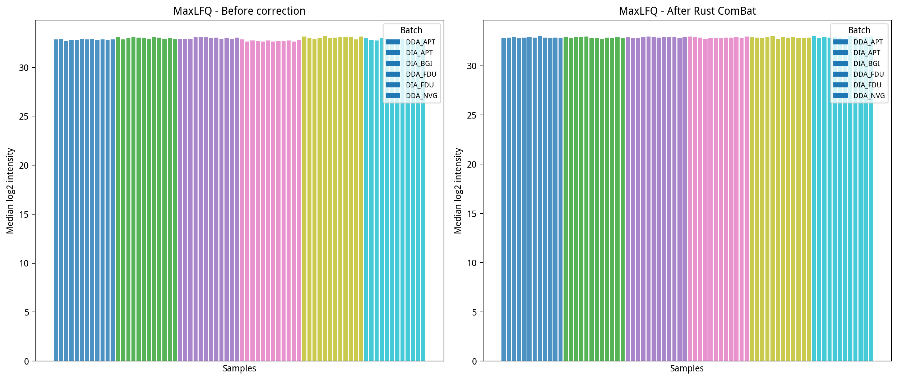
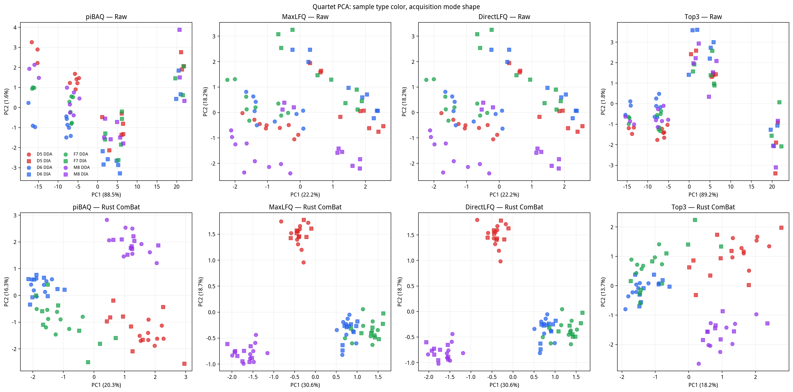

# Quartet Multi-Lab Batch Benchmark

This benchmark recomputes protein quantification and batch correction with the
current Rust-backed `mokume` distribution. The balanced design contains 72
samples from four laboratories (APT, BGI, FDU, and NVG), six acquisition/lab
batches, four Quartet sample types (D5, D6, F7, and M8), and three replicates of
each sample type per batch.

## Scope and interpretation

- Quantification methods: piBAQ, MaxLFQ, DirectLFQ, and Top3.
- Batch correction: native Rust ComBat.
- Raw matrices retain each method's available proteins. ComBat is fitted only
  to proteins complete across all 72 samples; no missing value is imputed.
- Cross-method diagnostics use the same 53 proteins that are complete for all
  four methods. This matched universe supports a fair diagnostic comparison,
  but it is not a basis for declaring one universal winner.

## Results

### Batch effect diagnosis

The original two-panel chart type is retained. It shows per-sample median
MaxLFQ intensity before and after Rust ComBat, with bars colored by batch.



Across the matched 53-protein universe, ComBat improved every method:

- piBAQ: inter-batch correlation 0.9151 to 0.9822; batch RMSE 1.6561 to 0.1739.
- MaxLFQ: inter-batch correlation 0.9355 to 0.9889; batch RMSE 0.3024 to 0.0957.
- DirectLFQ: inter-batch correlation 0.9355 to 0.9889; batch RMSE 0.3024 to 0.0956.
- Top3: inter-batch correlation 0.8159 to 0.9584; batch RMSE 1.6060 to 0.1783.

The CV and SNR metrics in `results/benchmark_metrics.csv` move in the same
direction. Their absolute values are specific to this complete, matched protein
universe and should not be compared with metrics calculated after imputation or
on method-specific protein sets.

### PCA before and after correction

The original before/after PCA layout is retained. Color represents Quartet
sample type and marker shape represents DDA or DIA acquisition.



The corrected projections show stronger sample-type separation, while DDA and
DIA observations remain visible rather than being silently pooled.

### Protein coverage

Coverage differs substantially by method:

- piBAQ: 1,569 observed proteins; 121 complete across all samples.
- MaxLFQ: 1,016 observed proteins; 56 complete across all samples.
- DirectLFQ: 2,163 observed proteins; 153 complete across all samples.
- Top3: 2,167 observed proteins; 154 complete across all samples.

Coverage, batch RMSE, correlation, CV, and SNR answer different questions, so
the benchmark reports them separately and does not collapse them into a single
method ranking.

## Reproduction

Clone the source benchmark and obtain its Git LFS data:

```bash
git clone https://github.com/qiaochuchen/proteomics-batch-effect-correction-benchmarking.git
cd proteomics-batch-effect-correction-benchmarking
git lfs pull
```

Run the current refresh from this benchmark directory. Keep `--work-dir`
outside the repository if the intermediates should remain disposable.

```bash
python scripts/refresh_rust.py \
  --source-dir /path/to/proteomics-batch-effect-correction-benchmarking/data/rawfiles/MaxQuant \
  --fasta /path/to/Homo-sapiens-uniprot-reviewed.fasta \
  --work-dir /tmp/mokume-quartet \
  --threads 24 \
  --force
```

The script validates the six `evidence.txt` inputs, reconstructs the balanced
72-sample design, quantifies all four methods with the Rust kernel, runs native
Rust ComBat, writes the result CSV files, and redraws the two existing PNG
figures. It does not use the historical `inmoose` or median-fill path.

## Reference

Chen Q, et al. *Protein-level batch-effect correction enhances robustness in
MS-based proteomics*. Nature Communications (2025). PMID: 41188254.
