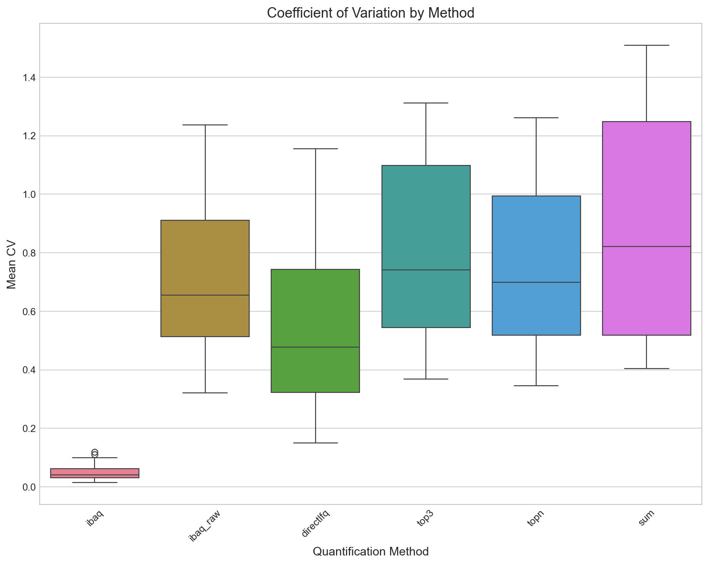
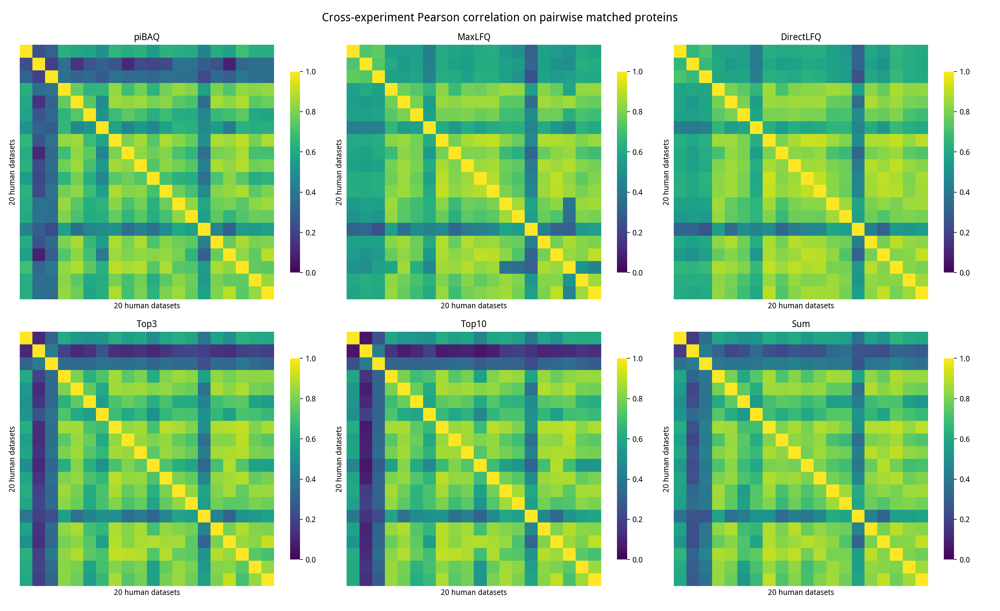

# HeLa Protein Quantification Benchmark

Benchmarking protein quantification methods for cross-experiment consistency using HeLa cell line datasets.

## Summary

This benchmark evaluated six protein quantification methods (iBAQ, iBAQ raw, DirectLFQ, Top3, TopN, Sum) across 20 HeLa/human proteomics datasets to determine which method produces the most consistent and reproducible results for cross-experiment comparisons.

**Winner: iBAQ (log-transformed)** with the highest cross-experiment correlation (0.741) and rank correlation (0.742).

---

## Results

### Cross-Experiment Correlation

| Method | Mean Cross-Corr | Mean Rank-Corr |
|--------|-----------------|----------------|
| **iBAQ** | **0.741** | **0.742** |
| iBAQ raw | 0.656 | 0.652 |
| DirectLFQ | 0.620 | 0.612 |
| Sum | 0.594 | 0.578 |
| Top3 | 0.530 | 0.503 |
| TopN | 0.511 | 0.470 |

### Within-Experiment Variability (CV)

The coefficient of variation (CV) measures technical reproducibility within experiments:

- **Lowest CVs:** iBAQ log-transformed showed consistently low CVs (typically 2-7%)
- **Highest CVs:** iBAQ raw and Sum methods showed higher variability

Best performing datasets (CV < 3%):
- PXD013658.1 (iBAQ): 1.7%
- PXD039414 (iBAQ): 1.5%
- PXD007683-LFQ (iBAQ): 2.4%



### Expression Stability (MAD)

| Method | Mean MAD |
|--------|----------|
| **iBAQ** | **0.033** |
| iBAQ raw | 2.39 |
| Top3 | 2.63 |
| TopN | 2.72 |
| DirectLFQ | 2.85 |
| Sum | 2.98 |

Log-transformed iBAQ shows dramatically better stability across experiments.

### Cross-Experiment Correlation Heatmap



### TMT vs LFQ Agreement

The benchmark included PXD007683 measured with both TMT and LFQ technologies:
- Both technologies showed consistent results when compared with the same quantification method
- iBAQ maintained good correlation between TMT and LFQ measurements

---

## Conclusions

### Recommendations by Use Case

1. **Cross-experiment comparisons**: Use **iBAQ (log-transformed)**
   - Best correlation across experiments
   - Most stable expression profiles
   - Good absolute quantification

2. **Within-experiment analysis**: Any method performs reasonably
   - DirectLFQ for trace alignment
   - TopN to reduce low-abundance peptide noise

3. **Absolute quantification**: Use **iBAQ**
   - Normalizes by theoretical peptide count
   - Comparable across different proteins

### Method Characteristics

| Method | Strengths | Weaknesses |
|--------|-----------|------------|
| iBAQ | Best cross-experiment correlation, stable | Requires FASTA file |
| DirectLFQ | Good within-experiment normalization | Lower cross-experiment correlation |
| TopN | Reduces noise from low-abundance peptides | Configuration-dependent |
| Sum | Simple, preserves dynamic range | Higher technical variability |

---

## Data Sources

All datasets obtained from PRIDE ibaqpy-research FTP:
- **URL:** https://ftp.pride.ebi.ac.uk/pub/databases/pride/resources/proteomes/ibaqpy-research/
- **Total:** 20+ HeLa and human proteomics datasets
- **Formats:** Parquet (quantms format), MSstats CSV

---

<details>
<summary><strong>Methodology & Reproduction</strong></summary>

### Quantification Methods Tested

| Method | Description | Parameters |
|--------|-------------|------------|
| **iBAQ** | Intensity / theoretical peptides | Requires FASTA file |
| **DirectLFQ** | DirectLFQ-backed trace alignment | min_peptides=2 |
| **TopN** | Mean of N most intense peptides | N=3, 5, 10 |
| **Sum** | Sum of all peptide intensities | - |

### Datasets

**HeLa Datasets (Cross-Experiment Analysis):**
- PXD004452 - Large DDA-LFQ, ~8,500 proteins
- PXD013658.1 - DIA-LFQ, ~9,000 proteins
- PXD048325 - DIA, ~7,700 proteins, 192 samples
- PXD000269 - DDA-LFQ, ~7,900 proteins
- PXD030406 - DDA-LFQ, ~4,600 proteins
- PXD010150 - DDA-LFQ, ~5,700 proteins

**TMT vs LFQ Comparison:**
- PXD007683-LFQ - Same samples measured with LFQ
- PXD007683-TMT - Same samples measured with TMT

### Evaluation Metrics

1. **Within-Experiment Variability (CV)** - Coefficient of Variation per protein across replicates
2. **Cross-Experiment Correlation** - Pearson correlation of median protein expression between datasets
3. **TMT vs LFQ Agreement** - Correlation for same proteins/samples between technologies
4. **Expression Profile Stability** - Median Absolute Deviation (MAD) of log-expression per protein
5. **Rank Consistency** - Spearman rank correlation across experiments

### Running the Benchmark

```bash
cd benchmarks/quant-hela-method-comparison

# Run complete pipeline
python scripts/run_benchmark.py

# Or run individual phases
python scripts/01_download_data.py    # Download data
python scripts/02_prepare_peptides.py  # Prepare peptides
python scripts/03_run_quantification.py # Run quantification
python scripts/04_compute_metrics.py   # Compute metrics
python scripts/05_generate_plots.py    # Generate plots
```

**Options:**
```bash
python scripts/run_benchmark.py --phase 3      # Start from phase 3
python scripts/run_benchmark.py --force        # Force recompute
python scripts/run_benchmark.py --hela-only    # Only HeLa datasets
python scripts/run_benchmark.py --comparison-only  # Only TMT/LFQ comparison
```

### Configuration

Edit `scripts/config.py` to modify:
- FASTA file path for iBAQ
- Dataset URLs and metadata
- Proteins of interest for tracking
- iBAQ parameters (enzyme, peptide length, etc.)
- TopN values to test

### Output Structure

```
quant-hela-method-comparison/
├── README.md
├── scripts/
│   ├── config.py
│   ├── run_benchmark.py
│   └── 01-07_*.py
├── data/               # GIT-IGNORED
├── results/            # CSV metrics
└── figures/            # PNG plots
```

### Requirements

```bash
pip install mokume-py[directlfq]
pip install matplotlib seaborn
```

</details>
