# TMT vs LFQ Quantification Benchmark

Comparing TMT (tandem mass tagging) and LFQ (label-free quantification) on the same samples to identify the best normalization method for technical reproducibility and cross-technology agreement.

## Summary

**Winner: `median-cov`** provides the lowest coefficient of variation, especially for LFQ experiments.

**Key Findings:**
1. **`median-cov` normalization** gives best technical reproducibility
2. **TMT shows lower CV** than LFQ across all normalization methods
3. **Both technologies agree** on relative protein abundances (high correlation)
4. **TMT better for small fold-changes** (< 2-fold); LFQ suitable for large-scale studies

---

## Dataset PXD007683

This dataset from **Gygi's lab** ([JPR publication](https://pubs.acs.org/doi/10.1021/acs.jproteome.8b00016)) tests TMT vs LFQ capacity to measure 3-, 2-, and 1.5-fold changes.

| Method | Samples | Proteins | Peptides | Features |
|--------|---------|----------|----------|----------|
| TMT | 11 | 9,423 | 77,439 | 1,409,771 |
| LFQ | 11 | 8,213 | 54,939 | 505,906 |

**Data URLs:**
- [PXD007683-TMT](https://ftp.pride.ebi.ac.uk/pub/databases/pride/resources/proteomes/quantms-benchmark/PXD007683-TMT/)
- [PXD007683-LFQ](https://ftp.pride.ebi.ac.uk/pub/databases/pride/resources/proteomes/quantms-benchmark/PXD007683-LFQ/)

---

## Results

### Coefficient of Variation by Method

`median-cov` has the smallest CV, especially in LFQ experiments:


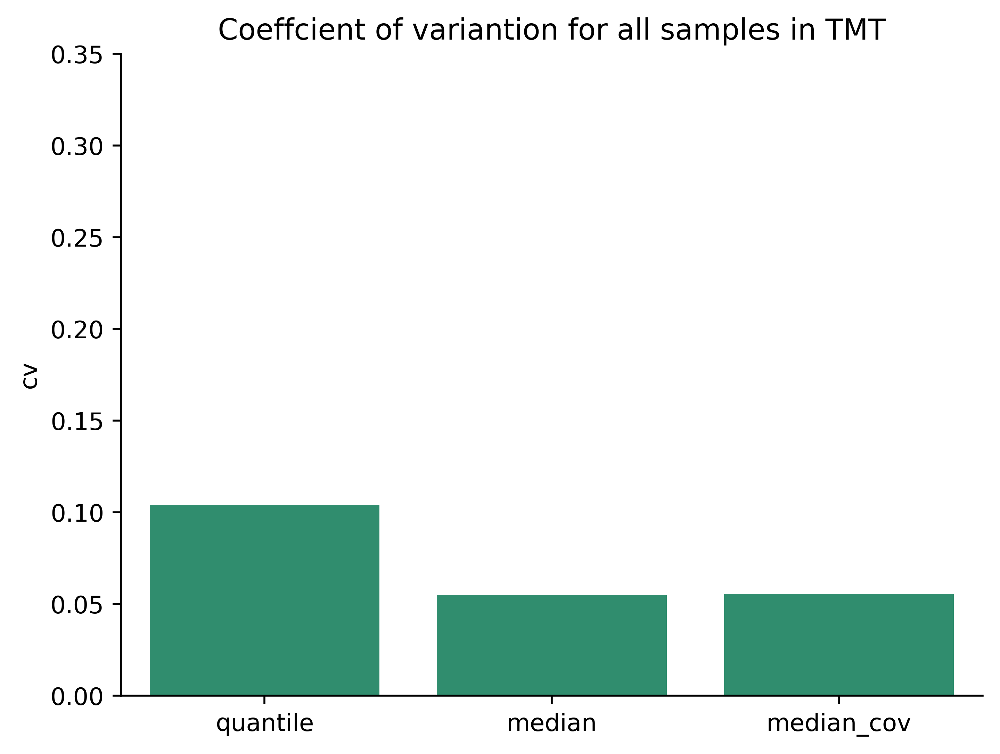

### Per-Protein Variability

CV of 30 randomly selected proteins across 11 samples:

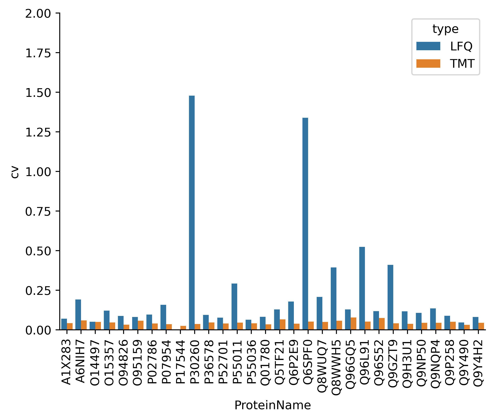


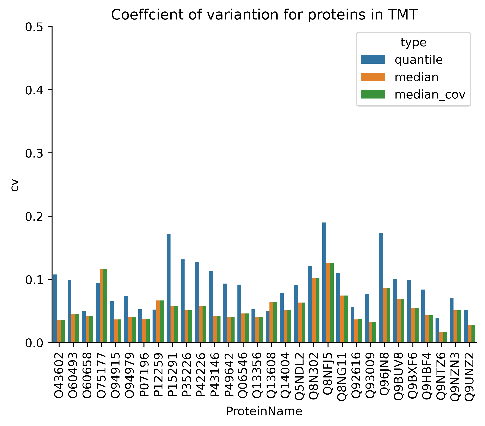

### TMT vs LFQ Correlation

Correlation of `log(rIBAQ)` values between TMT and LFQ using `median-cov`:

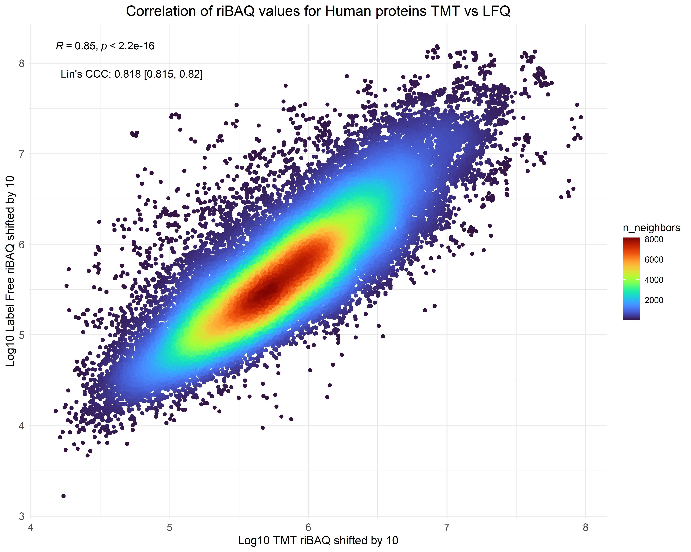

CV comparison boxplot - LFQ has higher CV than TMT:

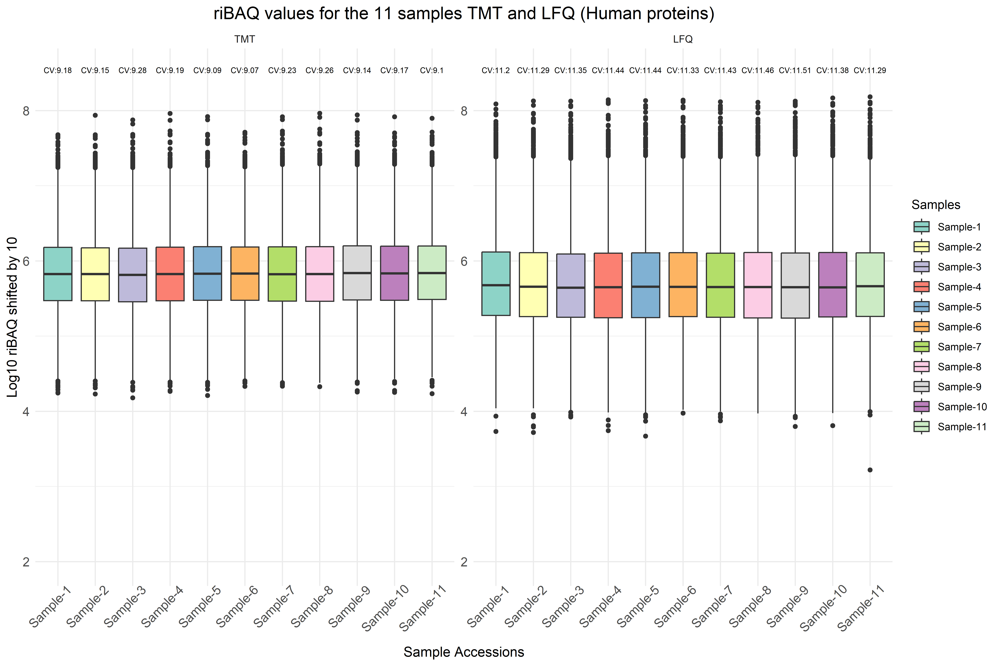

### Fold-Change Detection

Both methods accurately detect fold changes. TMT performs slightly better for smaller fold changes:


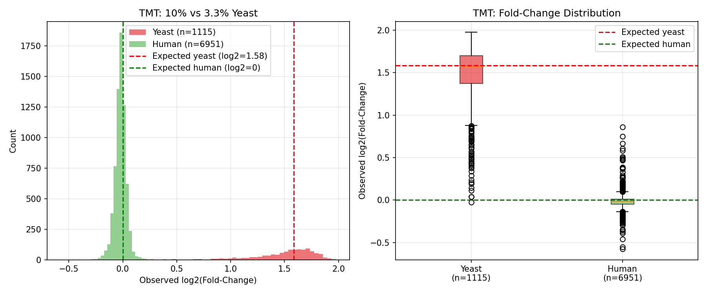

### Missing Values in LFQ


---

## Conclusions

| Use Case | Recommendation |
|----------|----------------|
| Best reproducibility | Use `median-cov` normalization |
| Small fold-changes (< 2-fold) | Prefer TMT |
| Large-scale studies | LFQ (no labeling needed) |
| Cross-technology integration | Both agree on relative abundances |

---

## Running the Benchmark

The benchmark includes comprehensive analysis scripts that answer three core scientific questions.

> **IMPORTANT: DirectLFQ Dependency**
>
> When using DirectLFQ quantification in benchmarks, **always use the external directlfq package** directly rather than any fallback implementation. This ensures reproducibility and uses the official Mann Lab algorithm.
>
> ```bash
> pip install mokume[directlfq]
> ```

### Quick Start

```bash
cd benchmarks/quant-pxd007683-tmt-vs-lfq/scripts

# Download data first
python 00_download_data.py

# Run complete benchmark
python run_benchmark.py

# Or run individual analyses
python 01_grid_search_methods.py      # Grid search over methods
python 02_variance_decomposition.py   # PCA and variance analysis
python 03_fold_change_accuracy.py     # Fold-change accuracy
python 04_stability_metrics.py        # CV analysis
python 05_cross_technology_correlation.py  # LFQ vs TMT correlation
python 06_generate_report.py          # Generate summary report
```

### Scientific Questions Addressed

| Question | Script | Metrics |
|----------|--------|---------|
| Q1: Absolute expression stability | `04_stability_metrics.py` | CV within conditions |
| Q2: Technical vs biological variance | `02_variance_decomposition.py` | PCA, silhouette score |
| Q3: Fold-change accuracy | `03_fold_change_accuracy.py` | RMSE, compression ratio, FPR |
| Cross-technology agreement | `05_cross_technology_correlation.py` | Pearson/Spearman r |

### Output

Results are saved to:
- `results/` - CSV files with metrics
- `figures/` - PNG plots
- `results/BENCHMARK_REPORT.md` - Comprehensive summary

See [ROADMAP-SCIENTIFIC-BENCHMARKING.md](ROADMAP-SCIENTIFIC-BENCHMARKING.md) for the full scientific framework.

---

<details>
<summary><strong>mokume vs MaxQuant Comparison</strong></summary>

### Correlation with MaxQuant iBAQ

For PXD007683-LFQ, comparing mokume's iBAQ values with MaxQuant:

**With `median-cov`:**

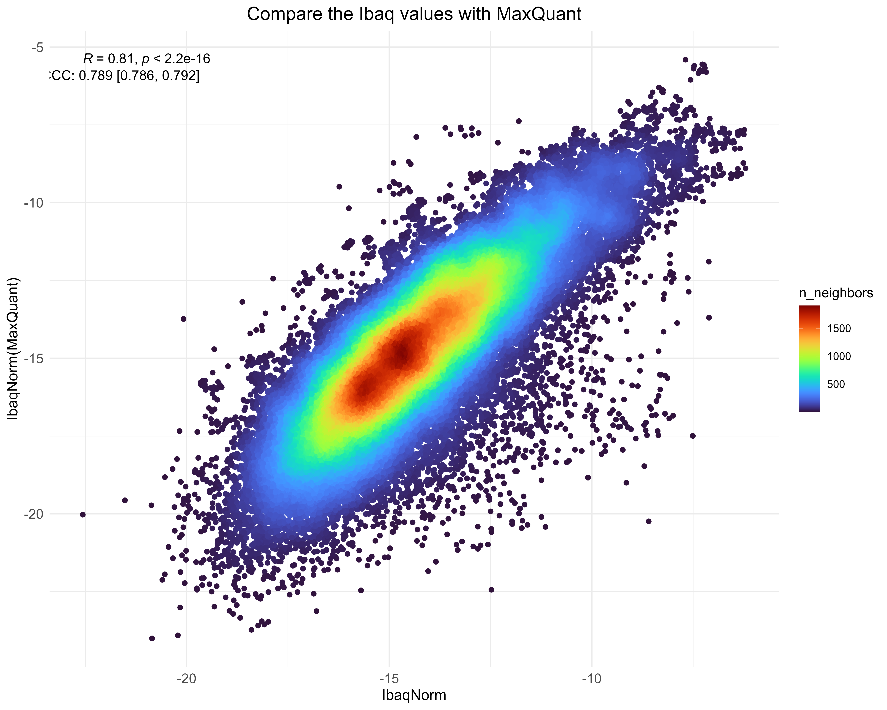

**Without coverage normalization (direct calculation):**

mokume's iBAQ values are very close to MaxQuant:

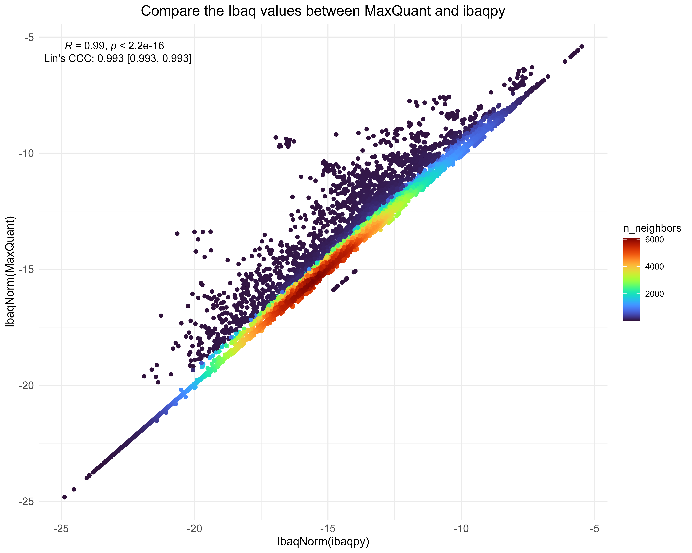

</details>

<details>
<summary><strong>Cross-Dataset Correlation (PXD010154 & PXD016999)</strong></summary>

### Additional Tissue Datasets

Testing how iBAQ values correlate across different experiments for integration in resources like [quantms.org/baseline](https://quantms.org/baseline).

**Datasets:**
- **PXD010154** (Kuster Lab): 29 tissues, LFQ, hSAX fractionation
- **PXD016999** (GTEx): 32 tissues, TMT 10plex

### CV for PXD016999 (Skin samples)

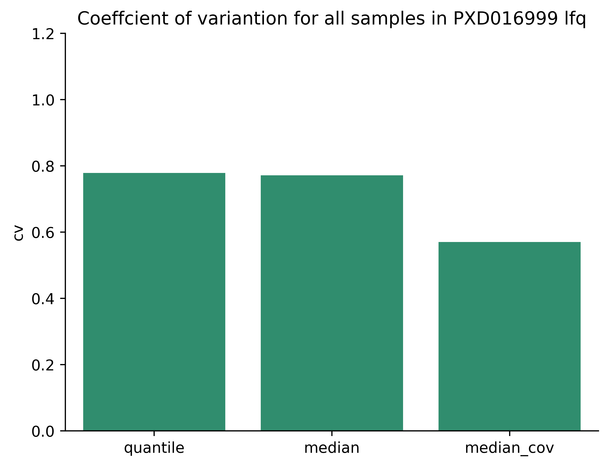

### Per-Protein CV

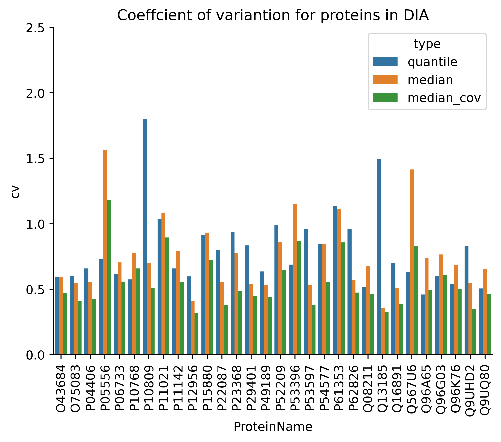

### Missing Values

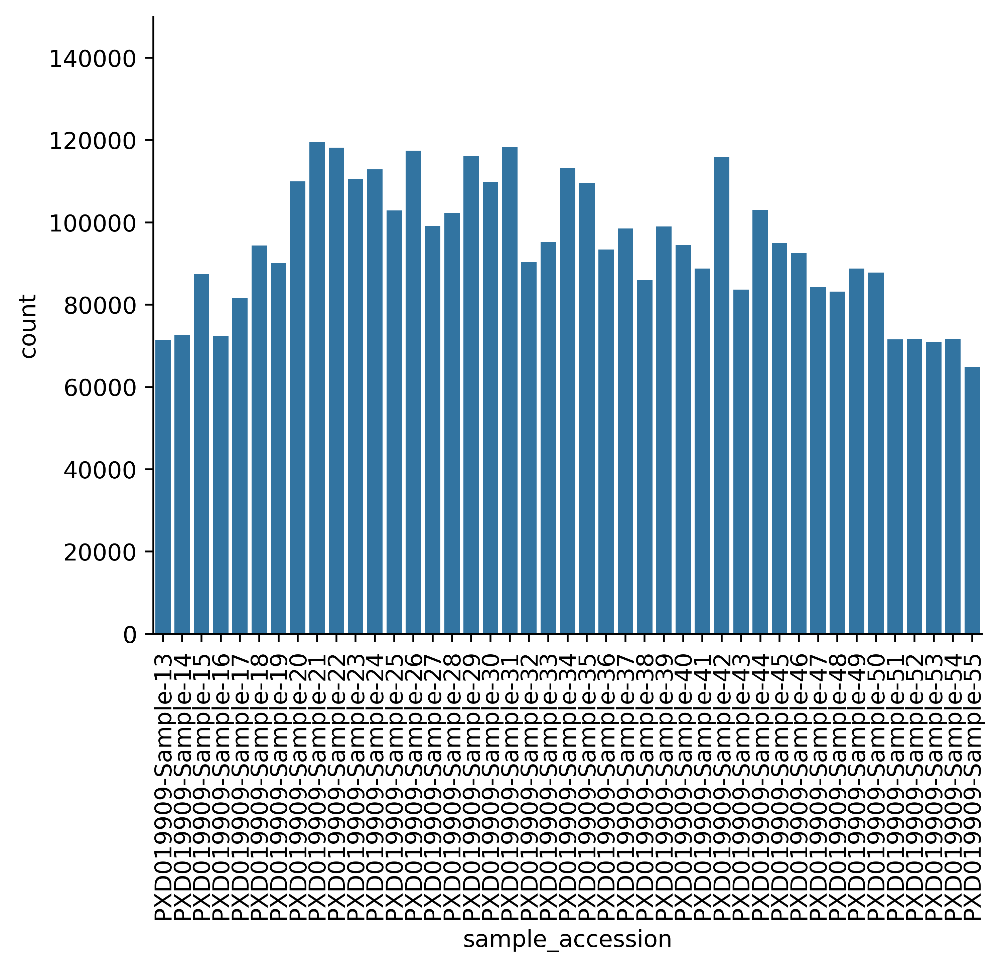

### Cross-Dataset Correlation

Correlation between MaxLFQ and iBAQ for PXD016999:

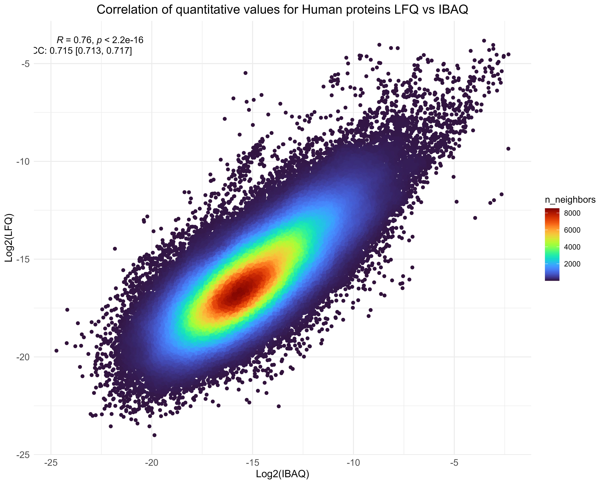

### 9 Shared Tissues Comparison

iBAQ log values for tissues shared between PXD016999 and PXD010154:

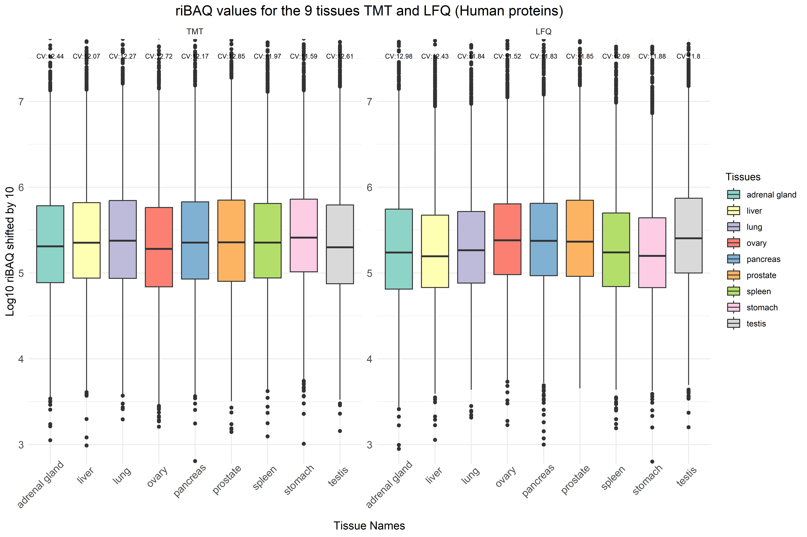

Correlation of riBAQ values:


</details>

<details>
<summary><strong>Performance Benchmarks</strong></summary>

### Memory and Runtime

The `median` method uses batch processing (20 samples at a time), reducing memory consumption ~4x compared to `quantile`:

| Project | File Size | MS Runs | Samples | Method | Memory | Runtime |
|---------|-----------|---------|---------|--------|--------|---------|
| PXD016999.1 | 5.7 GB | 336 | 280 | quantile | 36.4 GB | 14 min |
| | | | | median | 8.4 GB | 20 min |
| PXD019909 | 1.9 GB | 43 | 43 | quantile | 7.9 GB | 30 s |
| | | | | median | 4.0 GB | 1.4 min |
| PXD010154 | 1.9 GB | 1367 | 38 | quantile | 32.1 GB | 8 min |
| | | | | median | 16.2 GB | 12 min |
| PXD030304 | 167 GB | 6862 | 2013 | quantile | >128 GB | >2 days |
| | | | | median | 13.1 GB | 2.75 h |

</details>

<details>
<summary><strong>Methodology Notes</strong></summary>

### Normalization Methods

- **`quantile`**: Global mean/variance equalization across samples
- **`median`**: Median equalization across samples
- **`median-cov`**: Median equalization + coverage normalization (`sum(peptides)/n` where n = detected peptides)

### CV Calculation

1. Extract proteins common to all 11 samples
2. For each protein: `CV = σ / μ` across samples
3. Report mean CV across all proteins

### Data Processing

Datasets searched with SAGE, COMET, MSGF+, combined with ConsensusID, filtered at 1% protein and PSM FDR.

### Batch Correction Example

For batch correction examples, see `../batch-quartet-multilab/notebooks/mokume-batch-correction-example.ipynb`.

</details>
