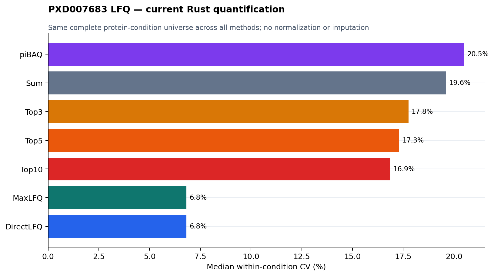
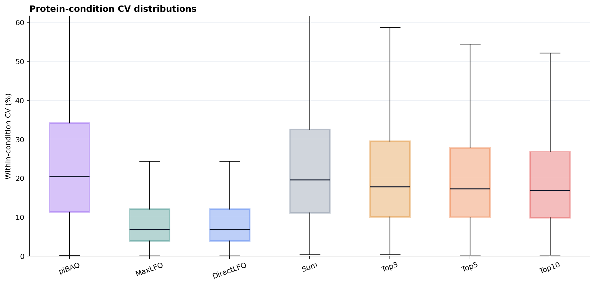
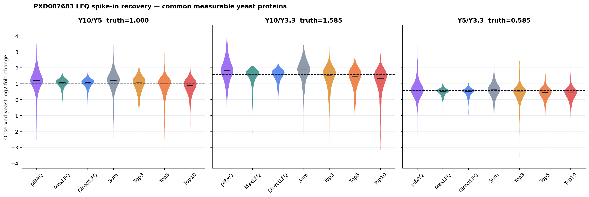
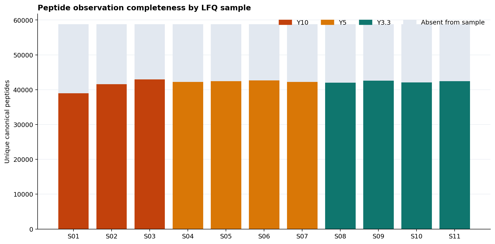

# PXD007683 LFQ Rust Quantification Benchmark

This directory contains TMT-versus-LFQ assets, while the reproducible refresh
covers the **11-sample LFQ arm** of PXD007683. The LFQ
input is `Bigbio_data/PXD_spike_in/PXD007683_LFQ`; it is not a different
PXD007683 dataset.

The study from [Gygi's lab](https://pubs.acs.org/doi/10.1021/acs.jproteome.8b00016)
uses a constant human background and three yeast spike-in levels:

| Condition | LFQ samples | Declared yeast level |
|-----------|-------------|----------------------|
| Y10 | 3 | 10 |
| Y5 | 4 | 5 |
| Y3.3 | 4 | 3.3 (study truth: three-fold below Y10) |

The expected yeast log2 fold changes used here are 1.000 for Y10/Y5,
1.585 for Y10/Y3.3, and 0.585 for Y5/Y3.3. Human proteins provide the
unchanged-background control.

## Current Rust LFQ refresh

The refresh runs `pibaq`, `maxlfq`, `directlfq`, `sum`, `top3`, `top5`, and
`top10` through the Rust-backed `mokume.features2proteins()` API. No run-level
or sample-level normalization and no imputation are applied.

The `pibaq` path uses runtime pyOpenMS digestion rather than a hand-written
`iBAQ` approximation. FASTA digestion uses the installed pyOpenMS Trypsin rule;
the Rust kernel performs shared-peptide allocation, the piBAQ denominator, and
matrix construction. The refresh uses peptide lengths 7–30 amino acids and zero
missed cleavages.

### Technical reproducibility

CV is compared on the same complete protein-condition universe for every
method. A zero-filled output cell is treated as missing evidence, not a measured
zero.

| Method | Classified proteins observed | Matrix completeness | Median within-condition CV |
|--------|------------------------------|---------------------|----------------------------|
| piBAQ | 8,662 | 83.2% | 20.5% |
| MaxLFQ | 6,179 | 86.3% | 6.8% |
| DirectLFQ | 6,910 | 92.3% | 6.8% |
| Sum | 6,629 | 81.6% | 19.6% |
| Top3 | 6,629 | 81.6% | 17.8% |
| Top5 | 6,629 | 81.6% | 17.3% |
| Top10 | 6,629 | 81.6% | 16.9% |





DirectLFQ and MaxLFQ have the lowest CV in this LFQ design, while piBAQ has the
widest human/yeast protein coverage. These measurements do not define a global
winner: piBAQ estimates abundance using a theoretical-peptide denominator,
whereas MaxLFQ and DirectLFQ target relative LFQ consistency.

### Spike-in response

Fold changes are compared on a common measurable protein universe for each
contrast. A protein must have at least two observed replicates in both groups
for every method.



The complete per-method values, including median bias and RMSE, are stored in
[`results/pxd007683_lfq_rust_fold_change.csv`](results/pxd007683_lfq_rust_fold_change.csv).
The plot reports declared spike-in recovery; it must not be interpreted as a
differential-expression or FDR benchmark.

### Peptide observation completeness



The observed/absent counts use the union of canonical peptide sequences in the
QPX feature table. They do not represent imputed values.

## Reproduce the LFQ refresh

Install the Rust-backed distribution with plotting dependencies:

```bash
python -m pip install "mokume[plotting]"
```

From the repository root, run:

```bash
MOKUME_BIGBIO_DATA=/data/shenyufei/Bigbio_data
python benchmarks/quant-pxd007683-tmt-vs-lfq/scripts/refresh_lfq_rust.py \
  --feature "$MOKUME_BIGBIO_DATA/PXD_spike_in/PXD007683_LFQ/qpx/PXD007683_LFQ.feature.parquet" \
  --sdrf "$MOKUME_BIGBIO_DATA/PXD_spike_in/PXD007683_LFQ/PXD007683_LFQ.sdrf.tsv" \
  --fasta "$MOKUME_BIGBIO_DATA/fasta/uniprotkb_proteome_HYE_UniversalContaminants.fasta" \
  --threads 24
```

The script writes the seven protein matrices to the ignored
`data/current-rust/lfq/` directory, versioned metric tables to `results/`, and
the four refreshed LFQ figures shown above to `figures/`.

## Reproduce the iBAQ comparator

`scripts/00_generate_ibaq.py` provides a benchmark-only, proteotypic-only iBAQ
baseline for comparison with piBAQ. Both its numerator and denominator exclude
peptides shared across canonical FASTA accessions. This isolates piBAQ's shared-
peptide allocation; it is not an exact MaxQuant or ibaqpy reproduction.

First create the peptide-level input without discarding shared peptides:

```bash
mokume quantify features2peptides \
  --parquet "$MOKUME_BIGBIO_DATA/PXD_spike_in/PXD007683_LFQ/qpx/PXD007683_LFQ.feature.parquet" \
  --sdrf "$MOKUME_BIGBIO_DATA/PXD_spike_in/PXD007683_LFQ/PXD007683_LFQ.sdrf.tsv" \
  --output /tmp/PXD007683-LFQ-peptides.parquet \
  --keep-shared-peptides \
  --run-normalization none \
  --sample-normalization none \
  --save-parquet
```

Then generate the baseline, its peptide-assignment audit, and a provenance JSON
containing input/output checksums, digest parameters, row counts, and runtime
versions:

```bash
python benchmarks/quant-pxd007683-tmt-vs-lfq/scripts/00_generate_ibaq.py \
  --lfq-peptides /tmp/PXD007683-LFQ-peptides.parquet \
  --fasta "$MOKUME_BIGBIO_DATA/fasta/uniprotkb_proteome_HYE_UniversalContaminants.fasta" \
  --output-dir /tmp/PXD007683-proteotypic-ibaq
```

## Scope of files not refreshed

The local input used for this refresh does not contain the TMT arm. The tracked
TMT plots, cross-technology plots, MaxQuant-iBAQ comparison, and broad
`results/BENCHMARK_REPORT.md` come from a separate Python workflow. They were
not mixed into the Rust LFQ results and should not be presented as a newly rerun
TMT-versus-LFQ comparison.

Large source data are not committed. Public processed-data locations remain:

- [PXD007683-LFQ](https://ftp.pride.ebi.ac.uk/pub/databases/pride/resources/proteomes/quantms-benchmark/PXD007683-LFQ/)
- [PXD007683-TMT](https://ftp.pride.ebi.ac.uk/pub/databases/pride/resources/proteomes/quantms-benchmark/PXD007683-TMT/)
