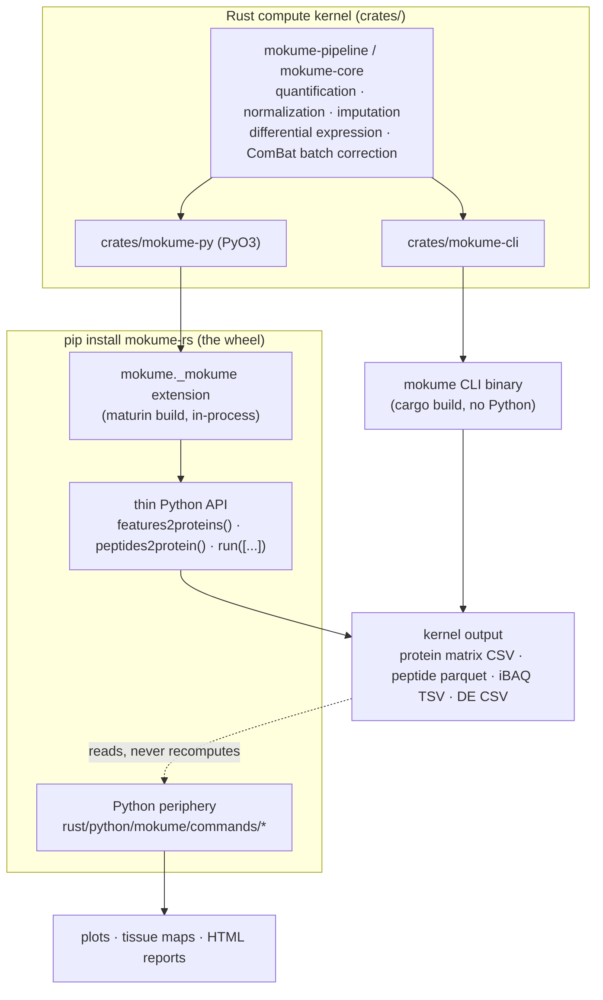

# Architecture

mokume is a **toolkit: a Rust compute kernel with a Python periphery**. The
compute lives once, in Rust, and is shipped two ways:

1. a **standalone CLI binary** `mokume` (built with `cargo`, no Python runtime
   needed), and
2. a **`pip install mokume-rs` wheel** (PyO3/maturin) whose compiled extension
   `mokume._mokume` runs the same kernel **in-process** — there is **no
   subprocess** and no shelling out to Python.

The numbers are **single-sourced in Rust**. The Python periphery (plotting,
tissue maps, interactive reports, iBAQ QC, and the few pure-Python method
fallbacks) reads the TSV / parquet / CSV tables the kernel writes and renders
figures or reports from them; it **never recomputes** the quantities.

## The kernel + wheel split

The CLI binary and the wheel are two front doors onto the **same** crates. The
wheel's compute wrappers parse their arguments through the same `clap`
definition the binary uses, so flag handling stays single-sourced in Rust.

## In-process, no subprocess

The wheel does **not** launch the CLI binary as a child process. `import mokume;
mokume.features2proteins(...)` calls straight into the compiled `mokume._mokume`
extension, which executes the Rust pipeline in the current process. This is the
PyO3/maturin layout used by projects such as polars and pydantic-core: Python
imports a compiled Rust extension rather than driving an external program.

!!! note "Why this matters"
    There is exactly one implementation of every quantity. The CLI binary, the
    wheel's `mokume.features2proteins(...)`, and `mokume.run([...])` all reach
    the same Rust code, so a result computed through the wheel is bit-for-bit
    the result the binary produces.

## The periphery reads, the kernel computes

The periphery lives in `rust/python/mokume/commands/` and is reached **only**
through the wheel. It opens the tables the kernel already wrote and draws from them:

- `mokume.tsne_visualization`, `mokume.de_plots`, `mokume.interactive_report` —
  plots and the HTML report built from the `features2proteins` matrix / DE CSVs.
- `mokume.tissuemap` — per-dataset tissue proteome analysis.
- `mokume.peptides2protein_qc` — the iBAQ `--verbose` QC report PDF.

Because these read kernel output, the cells in a plot match the cells in the
kernel matrix. The single documented exception is `mokume.peptides2protein_ibaq`,
which computes the whole iBAQ table in pure Python for enzymes outside the
Rust-ported set (see [CLI vs Wheel](cli-vs-wheel.md) and
[Python Periphery](periphery/index.md)).

## What stays in the separate `mokume_py` package

`agentic` — the LLM-driven workflow optimizer — is intentionally **not** migrated
to the Rust track and does **not** appear in the Rust top-level CLI. It lives in
the separate `mokume_py` Python package and is out of scope for this kernel +
wheel.
