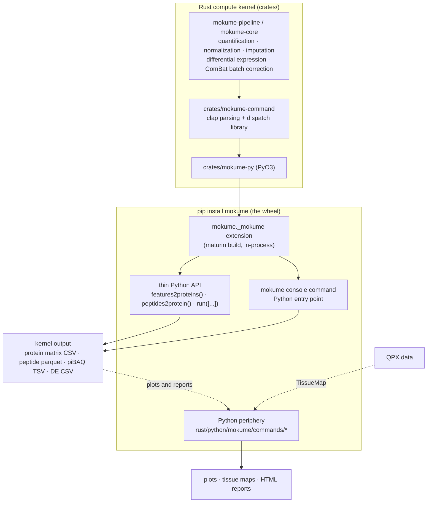

# Architecture

mokume is a **toolkit with two installable compute distributions**: the
leading Rust-backed `mokume` wheel and the separately maintained pure-Python
`mokume-py` package. The Rust
wheel contains the compiled `mokume._mokume` extension, a thin Python API, a
`mokume` console command, and the Python periphery. It does not ship a separate
Rust executable.

For Rust-backed commands, computed values are single-sourced in the kernel.
Plotting, interactive reports, and piBAQ QC read the tables the kernel writes;
TissueMap derives a downstream atlas from QPX outputs. Explicit Python-only
method fallbacks compute capabilities that the kernel does not provide. These
periphery and fallback paths are documented separately below. The pure-Python
package computes the same capabilities through its own implementation.

> **Distribution transition and measured performance.** `mokume<=0.1.0` was
> pure Python. Starting with 0.2.0, `mokume` is the Rust-backed wheel and the
> pure-Python distribution is `mokume-py`. Performance is workload-specific.
> On the 2026-08-23 `sum` parity rerun (PXD003539 / PXD004701, 24 threads, one
> warm-up, median of three measured runs), Rust/Python wall times were
> 8.95/7.17 seconds and 17.84/13.99 seconds; peak memory was 0.86/4.25 GiB and
> 1.29/8.02 GiB. Protein/sample sets and every matrix cell were exact. Quote
> these measured trade-offs rather than an unbounded speed claim.

## The Rust wheel

The wheel's console command and compute wrappers parse their arguments through
the same `clap` definition, so flag handling stays single-sourced in Rust.

## In-process, no subprocess

The `mokume` console command and `import mokume;
mokume.features2proteins(...)` both call the compiled `mokume._mokume`
extension, which executes the Rust pipeline in the current process. This is the
PyO3/maturin layout used by projects such as polars and pydantic-core: Python
imports a compiled Rust extension rather than driving an external program.

!!! note "Why this matters"
    There is exactly one Rust implementation of every quantity. The installed
    `mokume` command, `mokume.features2proteins(...)`, and `mokume.run([...])`
    all reach the same Rust code. The separate pure-Python distribution is not
    part of this in-wheel guarantee.

## Rust-native compute and the Python periphery

The periphery lives in `rust/python/mokume/commands/` and is reached **only**
through the wheel:

- `mokume.tsne_visualization`, `mokume.de_plots`, `mokume.interactive_report` —
  plots and the HTML report built from the `features2proteins` matrix / DE CSVs.
- `mokume.tissuemap` — downstream per-dataset normalization, batch correction,
  tissue-specificity scoring, embeddings, and atlas plots from QPX outputs.
- `mokume.peptides2protein_qc` — the piBAQ `--verbose` QC report PDF.

Plotting and reporting render kernel tables without re-running the
kernel-supported computation. TissueMap performs its documented downstream
analysis, while the `missforest` imputer is an explicit fallback for an operation
the kernel does not provide (see
[Rust Wheel](rust-wheel.md), [Python Periphery](periphery/index.md), and
[Analysis Fallbacks](periphery/analysis-fallbacks.md)).

piBAQ is a deliberate cross-language path within the base wheel: Python reads the
installed pyOpenMS `ProteaseDB` and digests the FASTA, PyO3 transfers the complete
protein-to-theoretical-peptide map, and Rust performs family discovery,
shared-peptide allocation, denominators, TPA, normalization, and output. Each
run at the default `debug` level (or explicit `info`) logs the pyOpenMS version,
canonical enzyme, catalog SHA-256, length bounds, and missed-cleavage count so
the runtime digest is traceable.

## The Mokume Plugin

Agentic recommendation is shipped as an installable host plugin under
`plugins/mokume/`, not as a model client inside either computation package. The
bundle contains one skill, automatic local MCP configuration, and a committed
knowledge snapshot. Its MCP process is provided by `mokume[agentic]` in the
default Rust-backed wheel.

The host model reads the skill and calls `mokume.inspect_dataset` with a
two-condition contrast to receive a contrast-scoped typed profile, deterministic
diagnostics, compatible evidence, and a bounded generation contract. It returns
an exact recommendation block to
`mokume.evaluate_recommendation`, which validates the block before running the
Rust matrix APIs. Mokume never receives the host's model API key.

The scientific boundary is explicit: ground-truth datasets may be ranked with
Score A; unlabelled datasets remain exploratory and have no winner. The plugin
starts from a protein matrix, so upstream quantification is provenance rather
than an executable search axis.

## The separate pure-Python package

Separately from the wheel, the pure-Python `pip install mokume-py` package carries a
full OOP compute pipeline: a `QpxDataset` container, a `PluginRegistry` of
quantification / normalization / imputation / harmonization methods, and
`run_pipeline(config) -> QpxDataset`. This entry point always uses the
pure-Python implementation. `RuntimeConfig` controls its DuckDB memory and
thread hints; it does not select another computation implementation.

Rust computation is reached through the default `mokume` wheel. The two
distributions both provide the `mokume` import
package, so they must not be installed together in one environment. Select the
implementation at installation time rather than routing one distribution into
the other at runtime.

Because the pure-Python package has its **own** implementation of the compute —
distinct from the Rust kernel — covered overlapping paths agree within their
documented floating-point tolerance, not bit-for-bit as the wheel's wrappers do
within the Rust distribution. Selected `features2proteins` paths are checked against
frozen compatibility goldens in `rust/tests/test_rust_python_equivalence.py`.
The API is documented under
[Python API (package)](reference/python-api-package.md).

The Rust kernel is the **leading** implementation of this shared computation and
the pure-Python package is maintained as added value; which side owns new work,
and the per-command support table, are set out in
[Maintenance scope](maintenance-scope.md).
