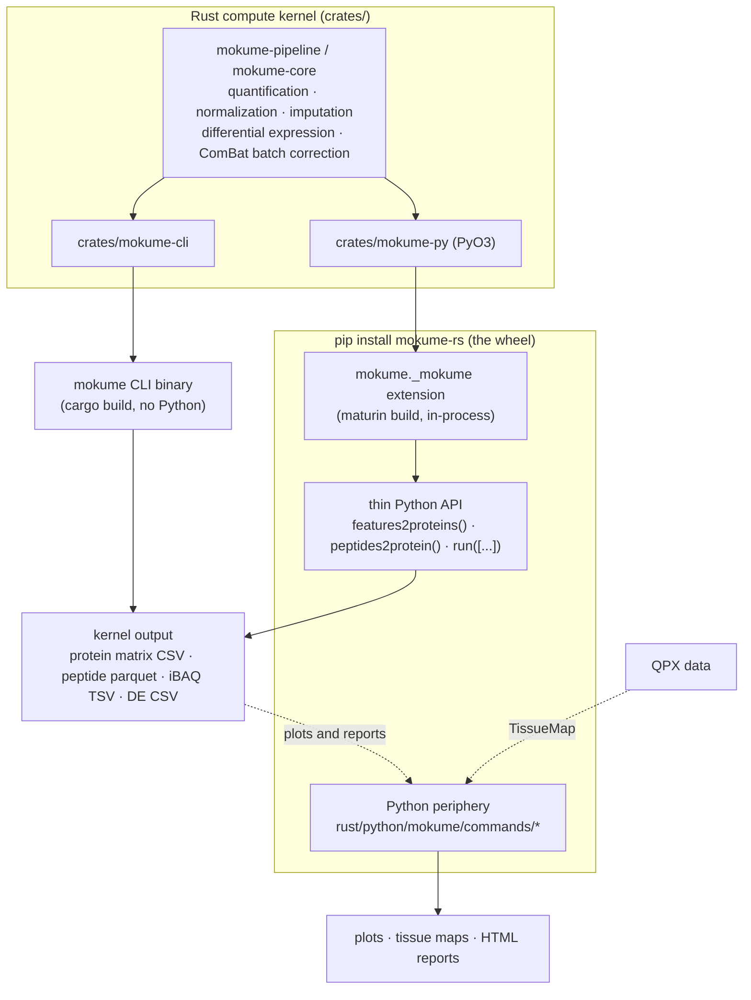

# Architecture

mokume has two computation implementations: the leading **Rust compute kernel**
and a separately maintained **pure-Python package**. The Rust kernel is shipped
through two entry points:

1. a **standalone CLI binary** `mokume` (built with `cargo`, no Python runtime
   needed), and
2. a **`pip install mokume-rs` wheel** (PyO3/maturin) whose compiled extension
   `mokume._mokume` runs the same kernel **in-process** — there is **no
   subprocess** and no shelling out to Python.

For Rust-native commands, computed values are single-sourced in the kernel.
Plotting, interactive reports, and iBAQ QC read the tables the kernel writes;
TissueMap derives a downstream atlas from QPX outputs. Explicit Python-only
method fallbacks compute capabilities that the kernel does not provide. These
periphery and fallback paths are documented separately below.

## The kernel + wheel split

The CLI binary and the wheel are two front doors onto the **same** crates. The
wheel's compute wrappers parse their arguments through the same `clap`
definition the binary uses, so flag handling stays single-sourced in Rust.

## In-process, no subprocess

The wheel does **not** launch the CLI binary as a child process. `import mokume;
mokume.features2proteins(...)` calls straight into the compiled `mokume._mokume`
extension, which executes the Rust pipeline in the current process. This is the
PyO3/maturin layout used by projects such as polars and pydantic-core: Python
imports a compiled Rust extension rather than driving an external program.

!!! note "Why this matters"
    The CLI binary, the wheel's `mokume.features2proteins(...)`, and
    `mokume.run([...])` all reach the same Rust implementation. A result computed
    through either Rust entry point therefore comes from the same kernel. The
    separate pure-Python computation package is not part of this guarantee.

## Rust-native compute and the Python periphery

The periphery lives in `rust/python/mokume/commands/` and is reached **only**
through the wheel:

- `mokume.tsne_visualization`, `mokume.de_plots`, `mokume.interactive_report` —
  plots and the HTML report built from the `features2proteins` matrix / DE CSVs.
- `mokume.tissuemap` — downstream per-dataset normalization, batch correction,
  tissue-specificity scoring, embeddings, and atlas plots from QPX outputs.
- `mokume.peptides2protein_qc` — the iBAQ `--verbose` QC report PDF.

Plotting and reporting render kernel tables without re-running the
kernel-supported computation. TissueMap performs its documented downstream
analysis, while `mokume.peptides2protein_ibaq` and the `missforest` imputer are
explicit fallbacks for operations the kernel does not provide (see
[CLI vs Wheel](cli-vs-wheel.md) and [Python Periphery](periphery/index.md)).

## What stays in the pure-Python package

`agentic` — the LLM-driven workflow optimizer — is intentionally **not** migrated
to the Rust track and does **not** appear in the Rust CLI or `mokume-rs` wheel.
It remains in the separately installed pure-Python `mokume` package under
`python/mokume/agentic/`.

## The pure-Python package and its compute backends

Separately from the wheel, the pure-Python `pip install mokume` package carries a
full OOP compute pipeline: a `QpxDataset` container, a `PluginRegistry` of
quantification / normalization / imputation / harmonization methods, and
`run_pipeline(config) -> QpxDataset`. By default it computes in pure Python; set
`RuntimeConfig.backend = "rust"` to route the supported features-to-proteins
configuration through the compiled `mokume._mokume` kernel instead (it raises a
clear error when the kernel is not installed).

The hybrid profile has an explicit stage boundary:

| Configuration area | Effective owner |
| --- | --- |
| Parquet and FASTA input, filtering, run/sample normalization, protein quantification, and peptide/ion exports | Rust kernel |
| QPX metadata, coverage filtering, IRS, imputation, batch correction, differential expression, plots, reports, and AnnData export | Python postprocessing |
| SDRF context, quantification-method selection, and ratio reference-sample selection | Shared across the boundary |
| Backend selection | Python hybrid adapter |

`duckdb_memory` and `duckdb_threads` are rejected for this profile because the
in-process kernel cannot enforce their documented per-run resource semantics.
Ion alignment accepts only `None` or `"none"`. Other method-specific invalid
combinations are forwarded so the Rust kernel retains its detailed validation
error. These checks happen before the extension is invoked or temporary output
is allocated.

Because the pure-Python package has its **own** implementation of the compute —
distinct from the Rust kernel — covered overlapping paths agree within their
documented floating-point tolerance, not bit-for-bit as the wheel's wrappers do
against the binary. Selected `features2proteins` paths are checked against
frozen compatibility goldens in `rust/tests/test_rust_python_equivalence.py`.
The API is documented under
[Python API (package)](reference/python-api-package.md).

The Rust kernel is the **leading** implementation of this shared computation and
the pure-Python package is maintained as added value; which side owns new work,
and the per-command support table, are set out in
[Maintenance scope](maintenance-scope.md).
