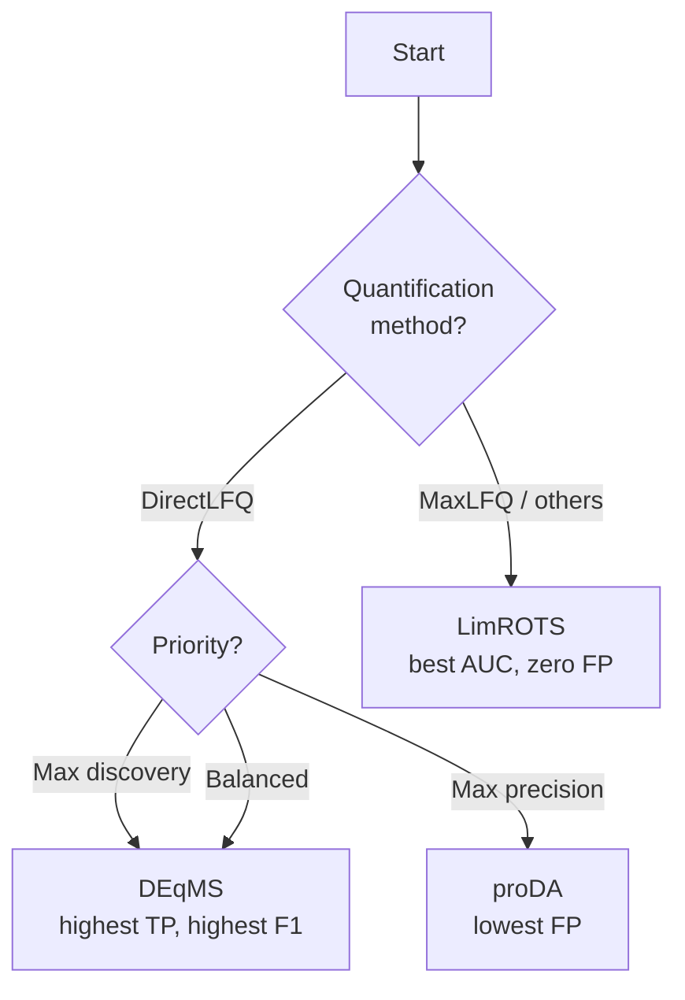

# Differential Expression

Differential expression (DE) analysis identifies proteins whose abundance changes significantly between experimental conditions. mokume provides three statistical methods, each with distinct strengths.

## Overview

| Method | Model | Key Feature | Needs Peptide Counts | Optional Dep |
|--------|-------|-------------|:--------------------:|:------------:|
| **LimROTS** | Reproducibility-optimized t-statistic | Bootstrap-tuned smoothing | No | No |
| **DEqMS** | Empirical Bayes with peptide-count weighting | Variance stabilization by spectrum count | Yes | No |
| **proDA** | Probabilistic dropout model | Dropout-aware likelihood | No | No |

## Choosing a Method



!!! tip "`--de-method auto`"
    When set to `auto` (the default), mokume selects **DEqMS** for DirectLFQ quantification and **LimROTS** for all other methods. You can always override this with `--de-method`.

## LimROTS

**Reproducibility-Optimized Test Statistic** (Suomi et al., 2017) uses bootstrapped resampling to find the optimal balance between fold-change and variance in a moderated t-statistic.

$$t_{\text{ROTS}} = \frac{\bar{x}_A - \bar{x}_B}{\alpha_1 + \alpha_2 \cdot s}$$

where $\alpha_1$ and $\alpha_2$ are optimized via bootstrap to maximize reproducibility across resampled datasets.

**Strengths:**

- Best overall ranking (highest AUC) on both quantification methods
- Zero or very low false positives — suitable for confirmatory studies
- No external dependencies; fully self-contained

**Weaknesses:**

- Lower sensitivity than DEqMS — may miss real differential proteins
- Computationally more expensive due to bootstrap iterations

```python
from mokume.analysis import DifferentialExpression

de = DifferentialExpression(
    method="limrots",
    fdr_method="bh",
    fdr_threshold=0.05,
    log2fc_threshold=0.5,
)
```

## DEqMS

**DEqMS** (Zhu et al., 2020) extends the limma empirical Bayes framework by weighting variance estimates with peptide/spectrum counts. Proteins quantified from more peptides get tighter variance estimates, boosting statistical power.

$$s^2_{\text{posterior}} = \frac{d_0 s^2_0 + d_i s^2_i}{d_0 + d_i}$$

where $d_0$ and $s^2_0$ are prior degrees of freedom and variance estimated via LOESS regression on peptide counts, and $d_i$, $s^2_i$ are per-protein residual degrees of freedom and variance.

**Strengths:**

- Highest sensitivity and F1 score — finds the most true positives
- Leverages peptide count information for better power
- Particularly effective with DirectLFQ, which preserves peptide-level detail

**Weaknesses:**

- Higher false positive rate than LimROTS or proDA
- Requires peptide count information (automatically provided by the pipeline)
- LOESS variance fitting can be unstable on small datasets, falling back to constant variance

```python
from mokume.analysis import DifferentialExpression

de = DifferentialExpression(
    method="deqms",
    peptide_counts=peptide_counts,  # dict: protein -> count
    fdr_method="bh",
    fdr_threshold=0.05,
    log2fc_threshold=0.5,
)
```

## proDA

**proDA** (Ahlmann-Eltze & Anders, 2020) uses a probabilistic dropout model that treats missing values as informative — proteins below the detection limit are more likely to be missing. This is modeled as a sigmoid dropout curve per sample.

$$P(\text{observed} \mid \mu) = \text{sigmoid}\left(\frac{\mu - \rho}{\zeta}\right)$$

where $\rho$ and $\zeta$ are per-sample dropout midpoint and width parameters estimated from the data.

**Strengths:**

- Lowest false positive rate — highest precision
- Handles missing values probabilistically instead of ignoring or imputing them
- No external dependencies

**Weaknesses:**

- Lowest AUC — weaker overall ranking of proteins
- More conservative, especially on low fold-change contrasts
- Dropout model adds computational overhead and may over-regularize on clean datasets with few missing values

```python
from mokume.analysis import DifferentialExpression

de = DifferentialExpression(
    method="proda",
    fdr_method="bh",
    fdr_threshold=0.05,
    log2fc_threshold=0.5,
)
```

!!! note "When to use proDA"
    proDA is most valuable when your protein matrix has **>30% missing values** and you suspect missingness is abundance-dependent (MNAR). On clean matrices with few missing values, LimROTS or DEqMS will typically outperform.

## FDR Correction

All methods produce raw p-values that are corrected for multiple testing. mokume supports two correction methods:

| Method | Description | When to Use |
|--------|-------------|-------------|
| `bh` | Benjamini-Hochberg | Default; robust and widely accepted |
| `ihw` | Independent Hypothesis Weighting | When a meaningful covariate exists (e.g., base mean expression) |

!!! info
    IHW requires a suitable covariate to improve power over BH. If no covariate is available, mokume falls back to BH automatically.

## Benchmark Reference

The following results are from the **PXD001819** UPS1 spike-in benchmark (48 UPS1 proteins spiked into yeast lysate, 3 contrasts at FC = 10×, 5×, 2.5×). Values are aggregated across all contrasts. Thresholds: FDR < 0.05, |log2FC| > 1.0.

### MaxLFQ (806 proteins)

| Method | AUC | TP | FP | FN | F1 |
|--------|-----|---:|---:|---:|---:|
| LimROTS+BH | **0.992** | 57 | **0** | 12 | 0.905 |
| DEqMS+BH | 0.985 | **61** | 1 | **8** | **0.933** |
| proDA+BH | 0.972 | 54 | **0** | 15 | 0.878 |

### DirectLFQ (1149 proteins)

| Method | AUC | TP | FP | FN | F1 |
|--------|-----|---:|---:|---:|---:|
| LimROTS+BH | **0.980** | 75 | 4 | 32 | 0.808 |
| DEqMS+BH | 0.969 | **89** | 12 | **18** | **0.860** |
| proDA+BH | 0.956 | 80 | **3** | 27 | 0.843 |

!!! warning "Benchmark limitations"
    These results are from a single spike-in dataset. Performance may vary with different organisms, sample complexity, missing value rates, and experimental designs. Always validate DE results with orthogonal methods.

## Practical Guidance

| Scenario | Recommended | Rationale |
|----------|-------------|-----------|
| **Exploratory / biomarker discovery** | DEqMS | Maximizes true positives; FP can be filtered by downstream validation |
| **Confirmatory / clinical validation** | LimROTS | Minimizes false positives; every reported hit is reliable |
| **High missing-value matrix (>30%)** | proDA | Dropout model handles MNAR missingness |
| **Don't know / general use** | `auto` | DEqMS for DirectLFQ, LimROTS for others |
