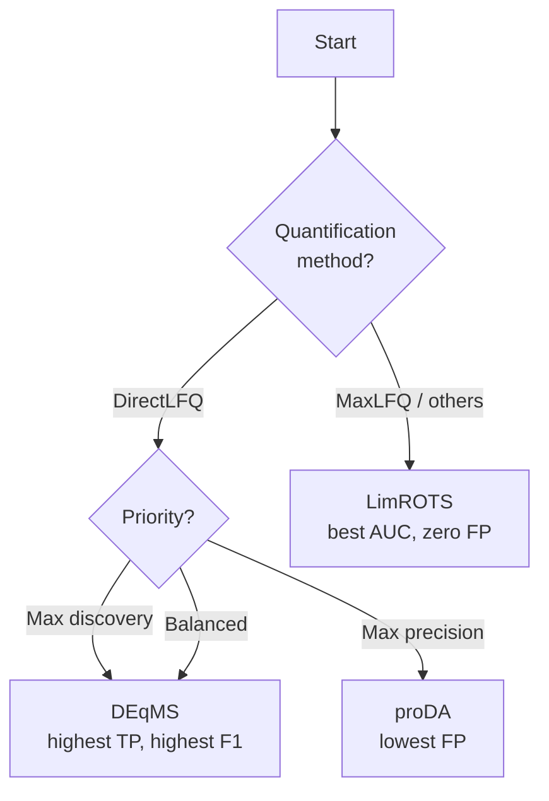

# Differential Expression

Differential expression (DE) analysis identifies proteins whose abundance changes significantly between experimental conditions. mokume provides a catalog of statistical methods implemented in the native Rust kernel, each with distinct strengths.

## Overview

| Method | Model | Key Feature | Needs Peptide Counts |
|--------|-------|-------------|:--------------------:|
| **LimROTS** | Reproducibility-optimized t-statistic | Bootstrap-tuned smoothing | No |
| **DEqMS** | Empirical Bayes with peptide-count weighting | Variance stabilization by spectrum count | Yes |
| **proDA** | Probabilistic dropout model | Dropout-aware likelihood | No |
| **limma** | Moderated t-test (empirical Bayes) | Stable baseline, small-sample friendly | No |
| **ROTS** | Reproducibility-optimized statistic | Data-adaptive test statistic | No |

## Choosing a Method



!!! tip "`--de-method auto`"
    When set to `auto` (the default), mokume selects **DEqMS** for DirectLFQ quantification and **LimROTS** for all other methods. You can always override this with `--de-method`.

!!! note "No R required"
    All DE methods run in the native Rust kernel. No R, rpy2, or Bioconductor packages are needed. The deterministic kernels (limma / deqms) are cell-exact on real data; the RNG/optimizer-driven methods (rots / limrots / proda) are faithful-not-bit-exact (log2FC cell-exact, p-value rank-level).

## From Python

The pure-Python package exposes the same methods through the
`DifferentialExpression` class. Pass a protein matrix (proteins × samples) and a
sample → condition mapping; it returns one result table per contrast:

```python
from mokume.analysis import DifferentialExpression

# protein_df: a DataFrame with ProteinName + one intensity column per sample
# sample_to_condition: {"sampleA": "Treatment", "sampleB": "Control", ...}
de = DifferentialExpression(method="limrots", fdr_method="bh")
results = de.run_comparisons(
    protein_df,
    sample_to_condition,
    contrasts=[("Treatment", "Control")],
)

# results["Treatment-Control"] -> ProteinName, log2FC, pvalue, adj_pvalue, significance
table = results["Treatment-Control"]
```

`method` accepts any of `limrots`, `deqms`, `proda`, `limma`, or `rots`
(the `ensemble` consensus is exposed through the CLI / `run_ensemble`,
not this class); `fdr_method` is `bh` (default), `ihw`, `bky`, or `storey`.
BKY and Storey fall back to BH when pi0 is not reliable. LimROTS and ROTS report
their own permutation-based FDR, which another FDR request leaves untouched.
`log2fc_threshold="auto"` estimates a mixture-model effect-size gate; the Rust
CLI exposes the same behavior as `--de-log2fc auto`. The
Rust build runs the same methods through the CLI shown below (and the in-process
wheel binding).

## LimROTS

**Reproducibility-Optimized Test Statistic** (Suomi et al., 2017) uses bootstrapped resampling to find the optimal balance between fold-change and variance in a moderated t-statistic.

$$t_{\text{ROTS}} = \frac{\bar{x}_A - \bar{x}_B}{\alpha_1 + \alpha_2 \cdot s}$$

where $\alpha_1$ and $\alpha_2$ are optimized via bootstrap to maximize reproducibility across resampled datasets.

**Strengths:**

- Best overall ranking (highest AUC) on both quantification methods
- Zero or very low false positives — suitable for confirmatory studies
- No external dependencies; fully self-contained

**Weaknesses:**

- Lower sensitivity than DEqMS — may miss real differential proteins
- Computationally more expensive due to bootstrap iterations

```bash
mokume features2proteins -p features.parquet -o proteins.csv -s experiment.sdrf.tsv \
    --de --de-contrasts "A vs B" \
    --de-method limrots \
    --de-fdr-method bh --de-fdr 0.05 --de-log2fc 0.5 \
    --de-output de_results.csv
```

## DEqMS

**DEqMS** (Zhu et al., 2020) extends the limma empirical Bayes framework by weighting variance estimates with peptide/spectrum counts. Proteins quantified from more peptides get tighter variance estimates, boosting statistical power.

$$s^2_{\text{posterior}} = \frac{d_0 s^2_0 + d_i s^2_i}{d_0 + d_i}$$

where $d_0$ and $s^2_0$ are prior degrees of freedom and variance estimated via LOESS regression on peptide counts, and $d_i$, $s^2_i$ are per-protein residual degrees of freedom and variance.

**Strengths:**

- Highest sensitivity and F1 score — finds the most true positives
- Leverages peptide count information for better power
- Particularly effective with DirectLFQ, which preserves peptide-level detail

**Weaknesses:**

- Higher false positive rate than LimROTS or proDA
- Requires peptide count information (automatically provided by the pipeline)
- LOESS variance fitting can be unstable on small datasets, falling back to constant variance

```bash
mokume features2proteins -p features.parquet -o proteins.csv -s experiment.sdrf.tsv \
    --de --de-contrasts "A vs B" \
    --de-method deqms \
    --de-fdr-method bh --de-fdr 0.05 --de-log2fc 0.5 \
    --de-output de_results.csv
```

Peptide counts are supplied automatically by the pipeline.

## proDA

**proDA** (Ahlmann-Eltze & Anders, 2020) uses a probabilistic dropout model that treats missing values as informative — proteins below the detection limit are more likely to be missing. This is modeled as a sigmoid dropout curve per sample.

$$P(\text{observed} \mid \mu) = \text{sigmoid}\left(\frac{\mu - \rho}{\zeta}\right)$$

where $\rho$ and $\zeta$ are per-sample dropout midpoint and width parameters estimated from the data.

**Strengths:**

- Lowest false positive rate — highest precision
- Handles missing values probabilistically instead of ignoring or imputing them
- No external dependencies

**Weaknesses:**

- Lowest AUC — weaker overall ranking of proteins
- More conservative, especially on low fold-change contrasts
- Dropout model adds computational overhead and may over-regularize on clean datasets with few missing values

```bash
mokume features2proteins -p features.parquet -o proteins.csv -s experiment.sdrf.tsv \
    --de --de-contrasts "A vs B" \
    --de-method proda \
    --de-fdr-method bh --de-fdr 0.05 --de-log2fc 0.5 \
    --de-output de_results.csv
```

!!! note "When to use proDA"
    proDA is most valuable when your protein matrix has **>30% missing values** and you suspect missingness is abundance-dependent (MNAR). On clean matrices with few missing values, LimROTS or DEqMS will typically outperform.

## limma

**limma** (Ritchie et al., 2015) fits linear models to log-expression data and uses empirical Bayes moderation of standard errors. It is the most widely used method in genomics and a stable baseline for proteomics.

**Strengths:**

- Extremely well-validated across thousands of studies
- Robust with small sample sizes (n ≥ 2 per group)
- Fast and computationally lightweight

**Weaknesses:**

- Does not account for peptide-count information
- May be less powerful than DEqMS when peptide counts are available

```bash
mokume features2proteins -p features.parquet -o proteins.csv -s experiment.sdrf.tsv \
    --de --de-contrasts "A vs B" \
    --de-method limma \
    --de-fdr-method bh --de-fdr 0.05 --de-log2fc 0.5 \
    --de-output de_results.csv
```

## ROTS

**ROTS** (Suomi et al., 2017) optimizes a test statistic for maximal reproducibility across bootstrap resamples. Unlike LimROTS (which also incorporates limma empirical Bayes), ROTS uses only the bootstrap-optimized statistic without shrinkage priors.

**Strengths:**

- Data-adaptive: optimizes its own test statistic shape
- Good performance across diverse data types

**Weaknesses:**

- Computationally expensive (bootstrap iterations)
- May be redundant with LimROTS in most scenarios

```bash
mokume features2proteins -p features.parquet -o proteins.csv -s experiment.sdrf.tsv \
    --de --de-contrasts "A vs B" \
    --de-method rots \
    --de-fdr-method bh --de-fdr 0.05 --de-log2fc 0.5 \
    --de-output de_results.csv
```

## Ensemble (top-k consensus)

The `ensemble` method runs several individual DE methods on the same
contrast and combines their per-protein verdicts using a top-k consensus
rule: a protein is called significant only when at least `min_k` member
methods agree on direction (UP or DOWN) and the Fisher-combined p-value
passes the FDR threshold.

**Output columns** include the median log2FC across members, the
Fisher-combined p-value (adjusted with the requested FDR method), `n_methods_up`, `n_methods_down`,
and `methods_significant` (comma-separated list of members that called
the protein).

**Strengths:**

- Higher precision than any single method by requiring agreement
- Naturally robust to method-specific failure modes
- Output exposes per-protein method agreement for downstream inspection

**Weaknesses:**

- Cost scales with the number of member methods
- May lose sensitivity for proteins that only one method can detect

```bash
mokume features2proteins -p features.parquet -o proteins.csv -s experiment.sdrf.tsv \
    --de --de-contrasts "A vs B" \
    --de-method ensemble \
    --de-ensemble-methods limrots,deqms,proda \
    --de-ensemble-min-k 2 \
    --de-fdr-method bh --de-fdr 0.05 --de-log2fc 0.5 \
    --de-output de_results.csv
```

## FDR Correction

All methods produce raw p-values that are corrected for multiple testing. mokume supports two correction methods:

| Method | Description | When to Use |
|--------|-------------|-------------|
| `bh` | Benjamini-Hochberg | Default; robust and widely accepted |
| `ihw` | Independent Hypothesis Weighting | When a meaningful covariate exists (e.g., base mean expression) |

!!! info
    IHW requires a suitable covariate to improve power over BH. If no covariate is available, mokume falls back to BH automatically.

## Benchmark Reference

The following results are from the **PXD001819** UPS1 spike-in benchmark (48 UPS1 proteins spiked into yeast lysate, 3 contrasts at FC = 10×, 5×, 2.5×). Values are aggregated across all contrasts. Thresholds: FDR < 0.05, |log2FC| > 1.0.

### MaxLFQ (806 proteins)

| Method | AUC | TP | FP | FN | F1 |
|--------|-----|---:|---:|---:|---:|
| LimROTS+BH | **0.992** | 57 | **0** | 12 | 0.905 |
| DEqMS+BH | 0.985 | **61** | 1 | **8** | **0.933** |
| proDA+BH | 0.972 | 54 | **0** | 15 | 0.878 |

### DirectLFQ (1149 proteins)

| Method | AUC | TP | FP | FN | F1 |
|--------|-----|---:|---:|---:|---:|
| LimROTS+BH | **0.980** | 75 | 4 | 32 | 0.808 |
| DEqMS+BH | 0.969 | **89** | 12 | **18** | **0.860** |
| proDA+BH | 0.956 | 80 | **3** | 27 | 0.843 |

!!! warning "Benchmark limitations"
    These results are from a single spike-in dataset. Performance may vary with different organisms, sample complexity, missing value rates, and experimental designs. Always validate DE results with orthogonal methods.

## Practical Guidance

| Scenario | Recommended | Rationale |
|----------|-------------|-----------|
| **Exploratory / biomarker discovery** | DEqMS | Maximizes true positives; FP can be filtered by downstream validation |
| **Confirmatory / clinical validation** | LimROTS | Minimizes false positives; every reported hit is reliable |
| **High missing-value matrix (>30%)** | proDA | Dropout model handles MNAR missingness |
| **Don't know / general use** | `auto` | DEqMS for DirectLFQ, LimROTS for others |
