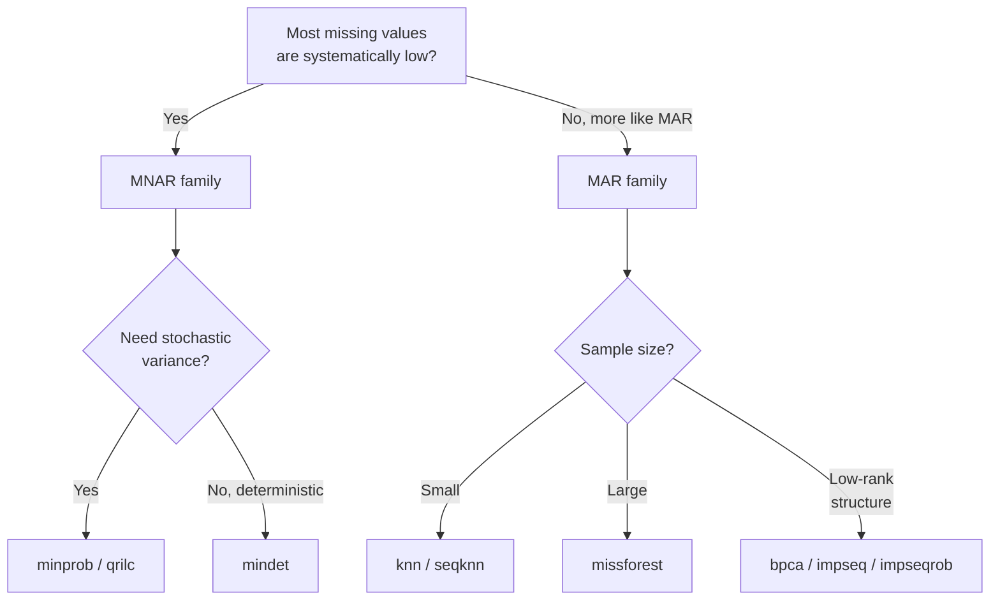

# Missing Value Imputation

Mass-spectrometry-based proteomics produces sparse intensity matrices: a
non-trivial fraction of cells are missing because either the analyte was
absent below the detection limit (**MNAR** — missing not at random) or
detection was stochastic / instrument-dependent (**MAR** / **MCAR**).
Different downstream analyses (PCA, batch correction, DE) tolerate
missingness very differently, so imputation is often required.

mokume runs imputation in the native Rust kernel **after** coverage
filtering and **before** batch correction in the `features2proteins`
pipeline (the `--impute` flag), plus a wheel-only standalone helper
`mokume.impute` for the methods the kernel does not reproduce.

## Pipeline Position

```text
LoadingStage → QuantificationStage → IRS → coverage filter
             → ImputationStage → BatchCorrection → DE
```

The protein matrix is converted to **log2 space** before imputation and
back to linear space afterwards. This is essential for censored-aware
methods (MinProb / MinDet / QRILC) which assume log-normal intensities.

## Method Categories

| Family | Methods | Assumption |
|--------|---------|------------|
| **Censored / MNAR** | `minprob`, `mindet`, `qrilc` | Missing values are systematically low |
| **Local-similarity (MAR)** | `knn`, `seqknn` | Similar samples / proteins share intensity patterns |
| **Iterative model (MAR)** | `missforest` | Missingness depends on observed values |
| **Latent / matrix-completion** | `bpca`, `gms`, `impseq`, `impseqrob` | A low-rank structure underlies the matrix |

## Censored-Aware Methods

### MinProb

Draws replacement values from the low tail of a per-sample normal
distribution (Perseus-style):

$$\mu = q_{\text{low}} - \text{shift} \cdot \sigma_{\text{scaled}}$$

where `q_low` is the `--impute-quantile`-quantile of observed log2
intensities, `shift` is `--impute-shift` standard deviations and
`sigma_scaled = sample_sd * --impute-scale`.

```bash
mokume features2proteins -p data.parquet -o out.csv \
    --impute --impute-method minprob \
    --impute-quantile 0.01 --impute-shift 1.6 --impute-scale 0.3
```

### MinDet

Replaces all missing values in a sample with a single deterministic
quantile of that sample's observed values. More conservative than
MinProb because it does not introduce sample-level variance.

```bash
mokume features2proteins -p data.parquet -o out.csv \
    --impute --impute-method mindet --impute-quantile 0.01
```

### QRILC

Quantile Regression Imputation of Left-Censored data: fits a truncated
normal to the observed distribution per sample and draws replacement
values from the truncated lower tail. Theoretically more principled
than MinProb when the MNAR assumption holds.

```bash
mokume features2proteins -p data.parquet -o out.csv \
    --impute --impute-method qrilc
```

## Local-Similarity Methods

### KNN

`sklearn.impute.KNNImputer` with `nan_euclidean` distance. Works on
per-protein vectors across samples; suitable when proteins co-vary.

```bash
mokume features2proteins -p data.parquet -o out.csv \
    --impute --impute-method knn --impute-n-neighbors 5
```

### SeqKNN

Sequential KNN orders proteins by missingness and imputes iteratively,
using already-imputed values as features for the next step (Kim et al.
2004). Runs natively in the Rust kernel.

```bash
mokume features2proteins -p data.parquet -o out.csv \
    --impute --impute-method seqknn --impute-n-neighbors 5
```

## Iterative Model Methods

### missForest

Random-forest-based iterative imputation (Stekhoven & Buehlmann 2011).
Generally the most accurate of the MAR family but the slowest.

!!! warning "Wheel-only"
    `missforest` is **not** ported to the Rust kernel — it wraps scikit-learn's
    `IterativeImputer` driven by `RandomForestRegressor`, whose tree-building and
    RNG cannot be reproduced cross-language. The Rust compute CLI does not
    advertise this method; use the wheel's Python analysis API:
    `mokume.impute(matrix, method="missforest")` (`pip install mokume[analysis]`).

## Latent / Matrix-Completion Methods

### BPCA

Bayesian PCA imputation (Oba et al. 2003). Fits a probabilistic low-rank
factorisation via EM and uses the model to predict missing entries.
Runs natively in the Rust kernel. In the OpDEA benchmark BPCA is a top-tier
imputer (best on MaxQuant TMT).

```bash
mokume features2proteins -p data.parquet -o out.csv \
    --impute --impute-method bpca
```

### GMS

Gaussian Mixture Sampling — fits a small mixture model to observed
values and draws missing entries from the appropriate component.
Runs natively in the Rust kernel. In the OpDEA benchmark GMS is the
best-performing imputer for FragPipe TMT data.

```bash
mokume features2proteins -p data.parquet -o out.csv \
    --impute --impute-method gms
```

### impSeq / impSeqRob

Sequential regression imputation following the variable-by-variable
ordering of the rrcovNA package; `impseqrob` uses MCD-based robust
regression to resist outliers. Both run natively in the Rust kernel.

```bash
mokume features2proteins -p data.parquet -o out.csv \
    --impute --impute-method impseq   # or: impseqrob
```

## Choosing a Method



Practical defaults:

- **DIA / DirectLFQ**: `mindet` (low missingness, mostly MNAR)
- **DDA-LFQ**: `minprob` for biology-driven MNAR, `knn` for technical MAR
- **TMT**: usually no imputation; if needed, `bpca` (MaxQuant) or `gms` (FragPipe) rank best in the OpDEA benchmark, otherwise `seqknn`
- **Single-cell proteomics**: `knn` or `missforest`

## Standalone API

The wheel exposes a single helper that runs any supported method on a wide
protein matrix CSV (or DataFrame) outside the pipeline. It reaches both the
kernel methods and the wheel-only `missforest` imputer, and is
available with `pip install mokume[analysis]`:

```python
import mokume

# Wide matrix: rows=proteins, columns=samples
mokume.impute("proteins.csv", method="minprob",
              quantile=0.01, shift=1.6, scale=0.3, output="imputed.csv")

mokume.impute("proteins.csv", method="knn", n_neighbors=5, output="imputed.csv")
mokume.impute("proteins.csv", method="missforest", output="imputed.csv")
```

The same methods run inside the pipeline via `--impute --impute-method <name>`,
which is the single-sourced path for the kernel-ported imputers.

## Caveats

- **Imputation is not free**: it introduces dependencies between samples
  that downstream tests may underestimate. Always report the imputation
  method and parameters.
- **Censored-aware methods inflate variance** in low-abundance proteins.
  Pair them with conservative FDR control.
- **MAR methods assume the MAR mechanism**; if missingness is dominated
  by left-censoring, MAR methods systematically over-estimate low
  intensities.
