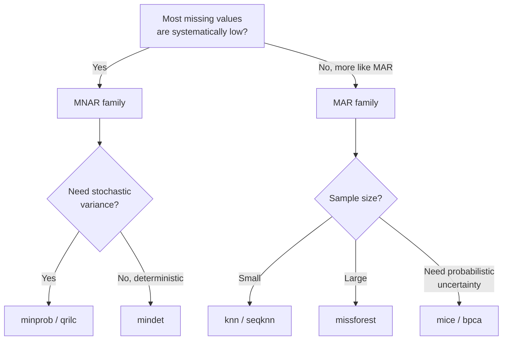

# Missing Value Imputation

Mass-spectrometry-based proteomics produces sparse intensity matrices: a
non-trivial fraction of cells are missing because either the analyte was
absent below the detection limit (**MNAR** — missing not at random) or
detection was stochastic / instrument-dependent (**MAR** / **MCAR**).
Different downstream analyses (PCA, batch correction, DE) tolerate
missingness very differently, so imputation is often required.

mokume exposes a unified `ImputationStage` that runs **after** coverage
filtering and **before** batch correction in the `features2proteins`
pipeline, plus a set of standalone utilities under `mokume.imputation`.

## Pipeline Position

```text
LoadingStage → QuantificationStage → IRS → coverage filter
             → ImputationStage → BatchCorrection → DE
```

The protein matrix is converted to **log2 space** before imputation and
back to linear space afterwards. This is essential for censored-aware
methods (MinProb / MinDet / QRILC) which assume log-normal intensities.

## Method Categories

| Family | Methods | Assumption |
|--------|---------|------------|
| **Censored / MNAR** | `minprob`, `mindet`, `qrilc` | Missing values are systematically low |
| **Local-similarity (MAR)** | `knn`, `seqknn`, `nbavg` | Similar samples / proteins share intensity patterns |
| **Iterative model (MAR)** | `mice`, `missforest`, `mle` | Missingness depends on observed values |
| **Latent / matrix-completion** | `bpca`, `gms`, `impseq`, `impseqrob` | A low-rank structure underlies the matrix |

## Censored-Aware Methods

### MinProb

Draws replacement values from the low tail of a per-sample normal
distribution (Perseus-style):

$$\mu = q_{\text{low}} - \text{shift} \cdot \sigma_{\text{scaled}}$$

where `q_low` is the `--impute-quantile`-quantile of observed log2
intensities, `shift` is `--impute-shift` standard deviations and
`sigma_scaled = sample_sd * --impute-scale`.

```bash
mokume features2proteins -p data.parquet -o out.csv \
    --impute --impute-method minprob \
    --impute-quantile 0.01 --impute-shift 1.6 --impute-scale 0.3
```

### MinDet

Replaces all missing values in a sample with a single deterministic
quantile of that sample's observed values. More conservative than
MinProb because it does not introduce sample-level variance.

```bash
mokume features2proteins -p data.parquet -o out.csv \
    --impute --impute-method mindet --impute-quantile 0.01
```

### QRILC

Quantile Regression Imputation of Left-Censored data: fits a truncated
normal to the observed distribution per sample and draws replacement
values from the truncated lower tail. Theoretically more principled
than MinProb when the MNAR assumption holds.

```bash
mokume features2proteins -p data.parquet -o out.csv \
    --impute --impute-method qrilc
```

## Local-Similarity Methods

### KNN

`sklearn.impute.KNNImputer` with `nan_euclidean` distance. Works on
per-protein vectors across samples; suitable when proteins co-vary.

```bash
mokume features2proteins -p data.parquet -o out.csv \
    --impute --impute-method knn --impute-n-neighbors 5
```

### SeqKNN / NBavg

Sequential variants that order proteins by missingness and impute
iteratively, using already-imputed values as features for the next
step. SeqKNN follows Kim et al. 2004; NBavg averages neighbour values.

## Iterative Model Methods

### MICE

Multiple Imputation by Chained Equations
(`sklearn.impute.IterativeImputer`). Models each protein as a function
of all others and iterates until convergence.

### missForest

Random-forest-based iterative imputation (Stekhoven & Buehlmann 2011).
Generally the most accurate of the MAR family but the slowest.

### MLE

Maximum-likelihood imputation under a multivariate normal assumption
via expectation-maximisation. Fast but assumes Gaussian distributions
in log2 space.

## Latent / Matrix-Completion Methods

### BPCA

Bayesian PCA imputation (Oba et al. 2003). Fits a probabilistic low-rank
factorisation via EM and uses the model to predict missing entries.

### GMS

Gaussian Mixture Sampling — fits a small mixture model to observed
values and draws missing entries from the appropriate component.

### impSeq / impSeqRob

Sequential regression imputation following the variable-by-variable
ordering of the rrcovNA package; `impseqrob` uses MCD-based robust
regression to resist outliers.

## Choosing a Method



Practical defaults:

- **DIA / DirectLFQ**: `mindet` (low missingness, mostly MNAR)
- **DDA-LFQ**: `minprob` for biology-driven MNAR, `knn` for technical MAR
- **TMT**: usually no imputation; if needed, `seqknn` or `knn`
- **Single-cell proteomics**: `knn` or `missforest`

## Standalone API

All methods are usable directly without going through the pipeline:

```python
from mokume.imputation import (
    impute_minprob,
    impute_mindet,
    impute_qrilc,
    impute_seqknn,
    impute_missforest,
    impute_mice,
    impute_mle,
    impute_bpca,
    impute_gms,
    impute_nbavg,
    impute_impseq,
    impute_impseqrob,
)

# Wide log2 matrix: rows=proteins, columns=samples
imputed = impute_minprob(log2_df, quantile=0.01, shift=1.6, scale=0.3)

# KNN goes through sklearn directly:
from sklearn.impute import KNNImputer
imputer = KNNImputer(n_neighbors=5, keep_empty_features=True)
imputed_knn = imputer.fit_transform(log2_df)
```

## Caveats

- **Imputation is not free**: it introduces dependencies between samples
  that downstream tests may underestimate. Always report the imputation
  method and parameters.
- **Censored-aware methods inflate variance** in low-abundance proteins.
  Pair them with conservative FDR control.
- **MAR methods assume the MAR mechanism**; if missingness is dominated
  by left-censoring, MAR methods systematically over-estimate low
  intensities.
