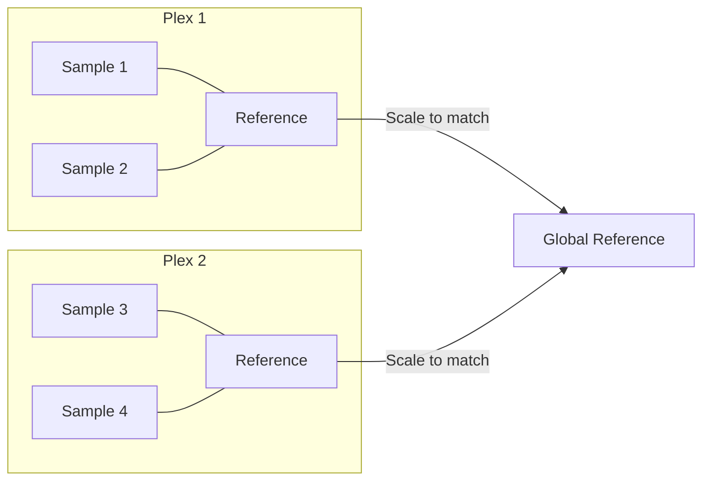

# IRS Normalization

**Internal Reference Scaling (IRS)** is a normalization strategy for multi-plex TMT experiments that use shared reference channels across plexes to make protein intensities comparable.

## The Problem

In a multi-plex TMT experiment, each plex is a separate MS run. Protein intensities within a plex are directly comparable, but intensities **across plexes** are not — they differ due to loading variation, MS sensitivity drift, and other technical factors.

## The Solution

IRS uses reference channels (e.g., pooled samples) that are present in every plex as anchors. By scaling each plex so that reference channel intensities match, all samples become comparable.



## Scaling Formula

For each protein in each plex:

$$\text{adjusted} = \text{raw} \times \frac{\text{global\_ref}}{\text{plex\_ref}}$$

Where:

- **plex_ref** = median (or mean) of reference channel intensities within the plex
- **global_ref** = geometric mean of plex_ref values across all plexes

## Reference Sample Detection

mokume automatically detects reference samples from SDRF metadata using a priority chain:

| Priority | Method | SDRF Source |
|:--------:|--------|-------------|
| 1 | `characteristics[pooled sample]` column | Values: `"pooled"` or `"SN=sample1;SN=sample2"` |
| 2 | Explicit sample names | Repeated `--irs-reference-sample` options |
| 3 | Column + values | `--irs-sdrf-column` + repeated `--irs-sdrf-value` |
| 4 | Regex scan | Searches all factor/characteristic columns for pattern |

Default regex: `pool|powder|ref|reference|bridge`

## Plex Detection

Plexes are detected from quantms-style source names in the SDRF:

| Source Name | Detected Plex |
|-------------|:-------------:|
| `p1_1` | `p1` |
| `p1_10` | `p1` |
| `p2_3` | `p2` |

The naming convention is `{plex}_{channel}`, where the plex ID is everything before the last `_digit`.

## Usage

### CLI

```bash
# Auto-detect references from SDRF
mokume quantify features2proteins \
    -p data.parquet -o proteins.csv -s experiment.sdrf.tsv \
    --quant-method median \
    --irs --irs-remove-reference

# Explicit reference samples
mokume quantify features2proteins \
    -p data.parquet -o proteins.csv -s experiment.sdrf.tsv \
    --irs --irs-reference-sample p1_11 --irs-reference-sample p2_11

# Custom regex for reference detection
mokume quantify features2proteins \
    -p data.parquet -o proteins.csv -s experiment.sdrf.tsv \
    --irs --irs-reference-regex "pool|bridge|control"
```

### Python (wheel)

```python
import mokume

# Auto-detect references and plexes from the SDRF
mokume.features2proteins(
    parquet="data.parquet",
    output="proteins.csv",
    sdrf="experiment.sdrf.tsv",
    quant_method="median",
    irs=True,
    irs_remove_reference=True,
)

# Explicit reference samples
mokume.features2proteins(
    parquet="data.parquet",
    output="proteins.csv",
    sdrf="experiment.sdrf.tsv",
    irs=True,
    irs_reference_sample=["p1_11", "p2_11"],
)
```

Reference and plex detection happen inside the kernel from the SDRF — the wheel
never recomputes them.

!!! note "Channel-based IRS"
    The SDRF-driven multi-plex IRS described here runs in `features2proteins`.
    The `features2peptides` channel path (`--irs-channel` /
    `--irs-autodetect-regex`) scales on the TMT `mixture` / `channel` columns and
    is implemented for all three scopes (`--irs-scope global` / `by-mixture` /
    `two-stage`); the reference channel is taken from `--irs-channel`, or
    auto-detected from the SDRF when `--irs-autodetect-regex` is given.

## Options

| Option | Default | Description |
|--------|---------|-------------|
| `--irs-stat` | `median` | Statistic for plex reference: `median` or `mean` |
| `--irs-remove-reference` | `False` | Remove reference samples from final output |
| `--irs-reference-regex` | `pool\|powder\|ref\|reference\|bridge` | Regex for auto-detection |

!!! info "IRS with Ratio quantification"
    When using `--quant-method ratio`, IRS is not applied because ratio quantification already handles cross-plex normalization via per-plex reference division.
