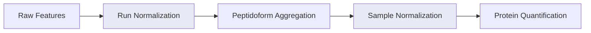

# Normalization

Normalization corrects systematic biases so that intensity differences between samples reflect true biological variation rather than technical artifacts.

mokume applies normalization at two levels: **run-level** (within samples) and **sample-level** (across samples).

## Pipeline Overview



## Run-Level Normalization

Run normalization (`--run-normalization`) adjusts for intensity differences between **technical replicates** within each sample. Applied when `technical_replicates > 1`.

| Method | Description | Formula |
|--------|-------------|---------|
| `median` | Normalize by median | intensity / median(intensity) |
| `mean` | Normalize by mean | intensity / mean(intensity) |
| `max` | Normalize by max | intensity / max(intensity) |
| `global` | Normalize by sum | intensity / sum(intensity) |
| `max_min` | Min-max scaling | (intensity - min) / (max - min) |
| `iqr` | Interquartile range | Uses IQR for scaling |
| `none` | No normalization | — |

```bash
mokume features2proteins -p data.parquet -o out.csv \
    --run-normalization median
```

## Sample-Level Normalization

Sample normalization (`--sample-normalization`) adjusts for systematic differences **across samples**. These methods fall into two categories:

### Per-Sample Methods

Applied during data loading, one sample at a time:

| Method | Description |
|--------|-------------|
| `globalMedian` | Divides each sample by its median, normalized to the global median |
| `conditionMedian` | Same as globalMedian but within each experimental condition |
| `none` | No normalization |

### Dataset-Level Methods

Applied after all samples are loaded, operating on the complete dataset:

| Method | Description |
|--------|-------------|
| `quantile` | Quantile normalization — forces identical intensity distributions across samples |
| `mediancenter` | Median centering — subtracts each sample's log2 median (location shift) |
| `meancenter` | Mean centering — subtracts each sample's log2 mean (location shift) |
| `rlr` | Robust Linear Regression against a reference profile (NormalyzerDE-style) |
| `loess` | LOESS regression on MA-plot residuals (intensity-dependent bias) |
| `tmm` | Trimmed Mean of M-values — robust to composition bias from highly abundant proteins |
| `hierarchical` | DirectLFQ-style hierarchical clustering normalization |

!!! tip "When to use hierarchical normalization"
    Use `--sample-normalization hierarchical` when you want DirectLFQ-style normalization **combined with a different quantification method** (e.g., piBAQ). This gives you the normalization quality of DirectLFQ with the quantification approach of your choice.

### Global Median

The default method. For each sample, computes:

$$\text{normalized} = \frac{\text{intensity}}{\text{sample\_median} / \text{global\_median}}$$

This ensures all samples have comparable median intensities.

### Hierarchical Normalization

Uses the DirectLFQ hierarchical clustering approach (Ammar et al., 2023) implemented natively in mokume:

1. Convert to log2 scale
2. Align samples using variance-guided pairwise normalization
3. Convert back to linear scale

You can optionally specify a set of proteins to use for normalization:

```bash
mokume features2proteins -p data.parquet -o out.csv \
    --sample-normalization hierarchical \
    --normalization-proteins housekeeping_proteins.txt
```

### LOESS Normalization

LOESS normalization corrects intensity-dependent bias between samples by
fitting local regression on MA-plot residuals (M = log2 sample / reference,
A = log2 mean). Exposed via the pipeline as `--sample-normalization loess`
or as a standalone utility on a log2-scale wide matrix.

```bash
mokume features2proteins -p data.parquet -o out.csv \
    --sample-normalization loess
```

LOESS runs natively in the Rust kernel (~2e-3 vs statsmodels lowess on real data).

### Quantile Normalization

Quantile normalization (`quantile`) makes every sample share an **identical
intensity distribution**. Working on log2 peptide sums, it replaces each value
with the cross-sample mean of all values at the same rank, so every column ends
up with the same sorted profile. It is the strongest distributional correction
available and assumes most features are unchanged across samples.

```bash
mokume features2proteins -p data.parquet -o out.csv \
    --sample-normalization quantile
```

Quantile normalization runs natively in the Rust kernel.

### Median and Mean Centering

Centering applies a **location shift in log2 space**: for each sample it
subtracts that sample's log2 median (`mediancenter`) or log2 mean
(`meancenter`), then maps the values back to linear scale
($2^{\log_2 x - \text{center}}$). Unlike quantile normalization it only aligns
the central level of each sample and leaves the within-sample spread untouched,
making it a lighter-touch alternative when distributions are already similar.

```bash
mokume features2proteins -p data.parquet -o out.csv \
    --sample-normalization mediancenter   # or: meancenter
```

Both centering variants run natively in the Rust kernel.

### RLR Normalization

Robust Linear Regression (`rlr`) fits, in log2 space, a robust (IRLS) linear
regression of each sample against a common reference profile and removes the
fitted intensity-dependent bias. The robust fit down-weights the minority of
genuinely changing proteins, so a handful of large fold-changes do not distort
the normalization (the approach used by NormalyzerDE).

```bash
mokume features2proteins -p data.parquet -o out.csv \
    --sample-normalization rlr
```

RLR runs natively in the Rust kernel.

### TMM Normalization

Trimmed Mean of M-values (`tmm`) picks a reference sample and, for every other
sample, computes a single scaling factor from the trimmed mean of the log2 ratios
(M-values) against that reference, down-weighting features at the extremes of
intensity and fold change. Trimming makes the factor **robust to composition bias
from highly abundant proteins**, so a few dominant proteins do not drag the whole
sample up or down (the edgeR/limma approach adapted for proteomics). Implemented
in `mokume.normalization.tmm.TMMNormalizer`.

```bash
mokume features2proteins -p data.parquet -o out.csv \
    --sample-normalization tmm
```

## DirectLFQ Mode

!!! warning "DirectLFQ handles its own normalization"
    When using `--quant-method directlfq`, the kernel runs **all processing** (normalization + quantification) through the native Rust DirectLFQ estimator. The `--run-normalization` and `--sample-normalization` options are ignored.
