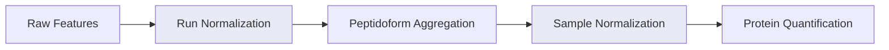

# Normalization

Normalization corrects systematic biases so that intensity differences between samples reflect true biological variation rather than technical artifacts.

mokume applies normalization at two levels: **run-level** (within samples) and **sample-level** (across samples).

## Pipeline Overview



## Run-Level Normalization

Run normalization (`--run-normalization`) adjusts for intensity differences between **technical replicates** within each sample. Applied when `technical_replicates > 1`.

| Method | Description | Formula |
|--------|-------------|---------|
| `median` | Normalize by median | intensity / median(intensity) |
| `mean` | Normalize by mean | intensity / mean(intensity) |
| `max` | Normalize by max | intensity / max(intensity) |
| `global` | Normalize by sum | intensity / sum(intensity) |
| `max_min` | Min-max scaling | (intensity - min) / (max - min) |
| `iqr` | Interquartile range | Uses IQR for scaling |
| `none` | No normalization | — |

```bash
mokume features2proteins -p data.parquet -o out.csv \
    --run-normalization median
```

## Sample-Level Normalization

Sample normalization (`--sample-normalization`) adjusts for systematic differences **across samples**. These methods fall into two categories:

### Per-Sample Methods

Applied during data loading, one sample at a time:

| Method | Description |
|--------|-------------|
| `globalMedian` | Divides each sample by its median, normalized to the global median |
| `conditionMedian` | Same as globalMedian but within each experimental condition |
| `none` | No normalization |

### Dataset-Level Methods

Applied after all samples are loaded, operating on the complete dataset:

| Method | Description |
|--------|-------------|
| `hierarchical` | DirectLFQ-style hierarchical clustering normalization |
| `tmm` | Trimmed Mean of M-values (Robinson & Oshlack, 2010) |

!!! tip "When to use hierarchical normalization"
    Use `--sample-normalization hierarchical` when you want DirectLFQ-style normalization **combined with a different quantification method** (e.g., iBAQ). This gives you the normalization quality of DirectLFQ with the quantification approach of your choice.

### Global Median

The default method. For each sample, computes:

$$\text{normalized} = \frac{\text{intensity}}{\text{sample\_median} / \text{global\_median}}$$

This ensures all samples have comparable median intensities.

### Hierarchical Normalization

Uses the DirectLFQ hierarchical clustering approach (Ammar et al., 2023) implemented natively in mokume:

1. Convert to log2 scale
2. Align samples using variance-guided pairwise normalization
3. Convert back to linear scale

You can optionally specify a set of proteins to use for normalization:

```bash
mokume features2proteins -p data.parquet -o out.csv \
    --sample-normalization hierarchical \
    --normalization-proteins housekeeping_proteins.txt
```

### LOESS Normalization

LOESS normalization corrects intensity-dependent bias between samples by
fitting local regression on MA-plot residuals (M = log2 sample / reference,
A = log2 mean). Exposed via the pipeline as `--sample-normalization loess`
or as a standalone utility on a log2-scale wide matrix.

```bash
mokume features2proteins -p data.parquet -o out.csv \
    --sample-normalization loess
```

```python
from mokume.normalization import loess_normalize

normalized = loess_normalize(log2_df, frac=0.75, reference="median")
```

### MBQN Normalization

Mean-Balanced Quantile Normalization (Brombacher et al., 2020) performs
standard quantile normalization and then rebalances each protein so its
across-sample mean matches its pre-normalization mean. This preserves
the rank-invariant property of quantile normalization while reducing
feature-level bias on heavily skewed distributions.

```bash
mokume features2proteins -p data.parquet -o out.csv \
    --sample-normalization mbqn
```

```python
from mokume.normalization import mbqn_normalize

normalized = mbqn_normalize(log2_df)
```

### VSN Normalization

Variance Stabilizing Normalization (Huber et al., 2002) fits a per-sample
affine + arsinh transformation to stabilise variance across the intensity
range. The pure-Python implementation is available as a standalone utility
only — it is intentionally **not** exposed via `--sample-normalization`
because VSN's glog2 output is incompatible with the pipeline's downstream
linear-scale assumptions (sum / median aggregation, IRS, coverage filter).

```python
from mokume.normalization import vsn_normalize

stabilised = vsn_normalize(linear_df)  # input is linear-scale
```

### TMM Normalization

Trimmed Mean of M-values computes normalization factors robust to composition bias from highly abundant proteins. Based on Robinson & Oshlack (2010).

```bash
mokume features2proteins -p data.parquet -o out.csv \
    --sample-normalization tmm
```

## DirectLFQ Mode

!!! warning "DirectLFQ handles its own normalization"
    When using `--quant-method directlfq`, mokume delegates **all processing** (normalization + quantification) to the DirectLFQ package. The `--run-normalization` and `--sample-normalization` options are ignored.
