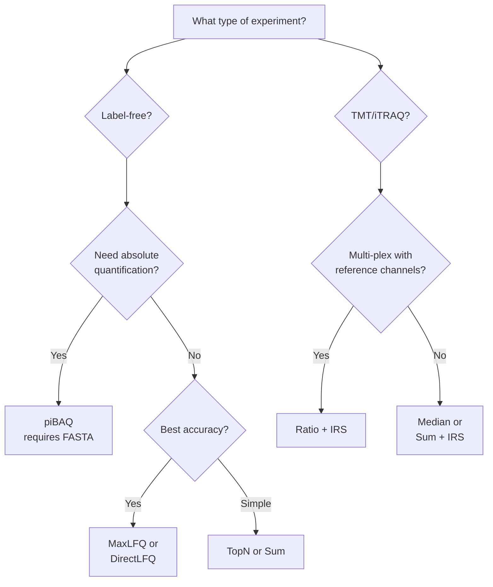

# Quantification Methods

mokume supports multiple protein quantification methods, each suited to different experimental designs and goals.

## Overview

| Method | Description | Requires FASTA | `--quant-method` |
|--------|-------------|:--------------:|------------------|
| **piBAQ** | Paralog-aware iBAQ with explicit shared-peptide allocation | Yes | `pibaq` |
| **TopN** | Average of N most intense peptides | No | `top<N>` (`top3`, `top5`, ...) |
| **MaxLFQ** | Pairwise peptide ratios and least-squares protein profiles | No | `maxlfq` |
| **DirectLFQ** | Intensity traces with hierarchical alignment | No | `directlfq` |
| **Sum** | Sum of all peptide intensities | No | `sum` |
| **Ratio** | Log2 sample/reference per plex (PS protocol) | No | `ratio` |
| **TMT Abundance** | Median of log2 peptide intensities | No | `abd` |
| **TMT Reporter Intensity** | Sum of raw reporter intensities | No | `intensity` |
| **Median** | Median of peptide intensities | No | `median` |
| **Peptide Count** | Distinct canonical peptides per (protein, sample) from feature QPX | No | `peptide-count` |
| **Spectral Count** | Unique spectra per (protein group, sample) from paired PSM/feature QPX | No | `spectral-count` |

All aggregation methods run in the Rust kernel. piBAQ obtains its theoretical
peptide map from the base pyOpenMS dependency; the other methods need no Python
compute dependency. MaxLFQ and DirectLFQ are native Rust ports — DirectLFQ is no
longer a separate Python dependency.

## Choosing a Method



## piBAQ (Paralog-Aware iBAQ)

The original **iBAQ** definition divides summed peptide intensities by the
number of theoretically observable peptides per protein:

$$\text{iBAQ} = \frac{\sum \text{peptide intensities}}{\text{theoretical peptide count}}$$

The commonly cited observable window is stated in the Usage Notes of
[Krey et al. 2018 *Scientific Data*](https://www.nature.com/articles/sdata2018128):
the denominator counts theoretical tryptic peptides between 6 and 30 amino
acids. Mokume now uses 30 as the upper-bound default everywhere. Its shared
feature-filter default remains `--min-aa 7`, so the out-of-the-box Mokume
window is 7–30; pass `--min-aa 6` when reproducing the cited 6–30 definition.

Mokume calls its family-aware extension **piBAQ**. It retains that iBAQ
scaling while assigning shared peptides explicitly. Peptides are assigned to
canonical entries unless an alternative isoform has its own uniquely mappable
peptide. Shared-peptide allocation follows the gpGrouper area rule
([Saltzman et al. 2018 *MCP* 17:2270](https://www.mcponline.org/content/17/11/2270));
the foundational iBAQ definition comes from
[Schwanhäusser et al. 2011 *Nature* 473:337](https://doi.org/10.1038/nature10098).
For each sample independently:

- If at least one mapped member has positive proteotypic-peptide intensity, the shared peptide is allocated in proportion to those member intensities. A zero-signal member receives exactly zero.
- If every mapped member has zero proteotypic-peptide intensity, the shared peptide is split equally among them.

Each shared peptide is counted once, so its allocated intensities sum to the observed intensity. The resulting per-member numerator is divided by that member's owned theoretical-peptide count.

The default standalone option `--min-anchors 1` (or
`features2proteins --pibaq-min-anchors 1`) implements this rule directly. If
the threshold is raised and no family member reaches it, piBAQ marks the family
`family_only` and forces equal shared-peptide allocation rather than trusting
sub-threshold anchors.

Family discovery proceeds in two layers:

1. **UniProt isoform collapse** — accessions of the form `P05067-2`, `P70255-3` are folded onto their canonical entry (`P05067`, `P70255`). This matches the UniProt convention and absorbs the bulk of "non-canonical isoform with no unique peptide" cases.
2. **Shared-peptide connected components** — proteins are grouped into a family when they share at least `min_shared` (default 2) digested peptides. Singleton families are equivalent to the per-protein baseline.

Power users can override either layer via standalone
`--families families.yaml` or `features2proteins --pibaq-families families.yaml`:

```yaml
families:
  - name: ACT
    members: [P60709, P63261, P68133]   # canonical accessions
  - name: HIST_H2A
    members: [P0C0S5, Q96QV6, P04908]
```

piBAQ requires a **FASTA file** to compute theoretical peptide counts via in-silico digestion.

=== "CLI"

    ```bash
    mokume quantify peptides2protein \
        --fasta proteome.fasta \
        --peptides peptides.csv \
        --enzyme Trypsin \
        --normalize \
        --quant-method pibaq \
        --output proteins-pibaq.tsv
    ```

=== "Python (wheel)"

    ```python
    import mokume

    mokume.peptides2protein(
        fasta="proteome.fasta",
        peptides="peptides.csv",
        enzyme="Trypsin",
        normalize=True,
        quant_method="pibaq",
        output="proteins-pibaq.tsv",
    )
    ```

!!! note
    piBAQ uses every protease registered by the installed pyOpenMS runtime,
    including `CNBr` and context-dependent rules such as
    `proline endopeptidase`. Python supplies the complete theoretical-peptide
    map and Rust performs the piBAQ aggregation.

The piBAQ output adds three metadata columns to the per-protein long-format table so users can audit protein-family support:

| Column | Type | Meaning |
|--------|------|---------|
| `FamilyId` | string | Canonical accession of the family representative (largest digested-peptide set) |
| `FamilySize` | int | Number of canonical members in the family (1 = singleton, isolated protein) |
| `EvidenceLevel` | enum | `high` (every member reaches the high-anchor threshold) / `medium` (at least one member reaches the minimum) / `family_only` (no member reaches the minimum) |

`family_only` means the data do not provide member-resolving anchor evidence. Shared signal is still conserved and allocated equally among the members it maps to; the final piBAQ values can differ because each member retains its own theoretical-peptide denominator.

Additional piBAQ-derived values:

| Value | Formula | Use Case |
|-------|---------|----------|
| PiBAQNorm | PiBAQ / sum(PiBAQ) per sample | Relative comparison |
| PiBAQLog | 10 + log10(PiBAQNorm) | Visualization |
| TPA | NormIntensity / MW | Total Protein Approach |
| CopyNumber | From ProteomicRuler | Absolute copy numbers |

TPA always uses each protein member's own molecular weight.

## TopN

Averages the **N most intense peptides** per protein per sample. The N is part
of the method name, so `--quant-method top3` averages the 3 most intense
peptides, `top5` the 5 most intense, and so on for any N ≥ 1.

Top3 is the classic choice — it is the named method from
[Silva et al. 2006 *MCP* 5:144](https://doi.org/10.1074/mcp.M500230-MCP200),
which showed that the mean intensity of a protein's three most intense
tryptic peptides scales with protein amount.

```bash
# Top3 (Silva et al. 2006)
mokume quantify features2proteins -p features.parquet -o proteins.csv \
    --quant-method top3

# Any other N — just write it in the method name
mokume quantify features2proteins -p features.parquet -o proteins.csv \
    --quant-method top5
```

!!! tip
    Top3 is a good default for label-free experiments when you don't need absolute quantification.

## MaxLFQ

Mokume implements the **MaxLFQ protein-quantification core** from
[Cox et al. (2014), Eq. 3 and Fig. 2](https://doi.org/10.1074/mcp.M113.031591).
Both the native Rust entrypoints and the separate `mokume-py` package use
pairwise peptide-species ratios and an unweighted least-squares solve.
MaxLFQ does not call DirectLFQ, regardless of installed optional packages.

For each protein, the solver:

1. Preserves sequence, modification and charge as the peptide-species identity.
   Feature inputs retain contextual ion maxima before summing repeated
   observations of the same species. Prepared peptide inputs sum duplicate
   species/sample rows. A canonical-only input cannot recover lost species data.
2. Uses positive, finite intensities to calculate median **log2** ratios for
   each sample pair. `--maxlfq-min-ratio-count` sets the required number of
   shared species per pair (default: 2), separately from protein peptide filters.
   Even-sized medians use the midpoint in log space.
   Optional `--stabilize` applies the paper's large-ratio stabilization (Eq. 5)
   to these pairwise ratios before solving the protein profile.
3. Solves the sample-ratio graph without a reference peptide, ridge penalty or
   median-aggregation fallback, then rescales the supported protein profile to
   the total input peptide intensity over all samples.

Samples without a valid ratio remain unquantified (zero in the Rust solver;
absent from positive long-format output and missing in the protein matrix).
Disconnected nontrivial sample components are solved separately and reported
with a warning. Their relative scales use each component's observed total,
followed by global total rescaling; this is an explicit convention because
shared-peptide ratios cannot identify offsets between disconnected components.
The Rust `solve_max_lfq` result exposes component membership.

Normalization remains an **explicit upstream step**. Fraction-aware delayed
normalization (the paper's Eq. 1–2) is not implemented. This core is not a complete reproduction of the MaxQuant
workflow. For already normalized input, choose `none` explicitly to avoid
applying another normalization step.

`--stabilize` is **off by default** and is accepted only with MaxLFQ, by both
`quantify features2proteins` and `quantify peptides2protein`. For each protein
and sample pair, let `x = max(n_A, n_B) / n_shared`. Eq. 5 sets
`w = clip((x - 2.5) / 2.5, 0, 1)` and combines the median log2 peptide ratio
with the log2 ratio of total peptide intensities using weights `1-w` and `w`.
Thus at least 40% overlap retains the ordinary ratio; at most 20% overlap uses
the total-intensity ratio; intermediate overlap blends them in log space.
The original minimum shared-species requirement still applies. Zero overlap
never creates a ratio, and stabilization cannot connect disconnected components.

This adapts the weight to observed peptide overlap, not to known condition
labels or true fold changes. Random missingness can also produce low overlap,
so stabilization can worsen some ratios and does not guarantee greater accuracy.
The run log records the setting, minimum ratio count, and numbers of protein
groups and sample pairs assigned positive stabilization weights. Those counts
describe where the rule was applied, not where accuracy improved.

```bash
mokume quantify features2proteins -p features.parquet -o proteins.csv \
    --quant-method maxlfq --maxlfq-min-ratio-count 2 \
    --run-normalization none --sample-normalization none

mokume quantify peptides2protein --quant-method maxlfq -p peptides.csv -o proteins.tsv \
    --maxlfq-min-ratio-count 2 --threads 24

# Optional large-ratio stabilization for prepared peptide input
mokume quantify peptides2protein --quant-method maxlfq -p peptides.csv -o proteins.tsv \
    --stabilize --threads 24
```

The old `force_builtin` API option is retained as a no-op. Python's
`min_peptides` argument remains an alias for `min_ratio_count`; use the latter
for clarity. Rust's `max_lfq` and `max_lfq_with_samples` now return `Result` so
numerical failures are propagated rather than replaced with another algorithm.
The configurable Rust solver is `solve_max_lfq_with_stabilization`; Python
accepts `MaxLFQQuantification(stabilize=True)` and
`QuantificationConfig(stabilize=True)`. Older serialized Rust configurations
without the new field retain disabled stabilization and minimum ratio count 2.

The independent third-party [iq implementation](https://github.com/tvpham/iq)
is useful for checking within-component log ratios. Its published R solver
uses a mean-log intensity anchor and quantifies isolated samples by a median;
these conventions differ from the profile-total scaling and unsupported-sample
handling used here. It is not an original-author MaxLFQ library.

Verification of the unstabilized core on 2026-09-09 used the published `iq::maxLFQ` R function
(source file `R/iq.R`, R 4.5.3), not an installed original-author library.
The extracted function file, including its provenance comments, had SHA256
`ad7a6aff88aa5a4dd45457e5e679a306bfd359d006c3c516cb8a8fca169df329`.
With seed 42, 38 synthetic matrices covered 2–100 samples and missing values;
the common comparison used minimum ratio count 1. The largest within-component
log2-ratio difference was 1.75e-13 (rounded upward). After explicitly adjusting
iq's scale to the Cox total-intensity convention, the largest relative error
was 6.88e-14. One isolated-sample output differed as described above. These are
synthetic correctness checks, not performance benchmark results.

A separate real-input check used the local PXD000279 OpenMS/quantms QPX
reprocessing (feature SHA256
`4be9ba9da7241acfd05d81945694353b8ebfec6c91e103353c6bb3d673373621`).
Its 1,302,231 feature rows cover six samples and 143 fraction runs. The native
pipeline, with both normalization options set to `none` and minimum ratio count
2, returned 5,400 protein groups and 29,349 finite protein/sample values.
From sorted input/output protein identifiers, seed 42 selected 100 proteins
with at least two shared species for every sample pair, so iq's minimum-one
pair rule and the native minimum-two rule used the same graph. Inputs retained
1,850 species and 2,262 missing species/sample cells. All 600 output values
passed predeclared `rtol=1e-10, atol=1e-6` after total-intensity rescaling;
the maximum relative error was 5.94e-14 and the maximum pairwise log2-ratio
difference was 1.04e-13 (both rounded upward).

This check used explicit DuckDB preparation matching native ingestion,
including its existing policy of retaining null `unique` annotations. The
Python feature loader instead requires `unique = 1` and returns no rows for
this QPX, whose `unique` column is entirely null. This pre-existing ingestion
difference remains unresolved; retaining unknown uniqueness does not establish
that these are biologically unique peptides. The check establishes solver
agreement on matching input, not full Rust/Python pipeline agreement.

The local protein table contains unnormalized Top3 results, not original
MaxQuant LFQ output. The SDRF, RAW manifest and checksum list all omit fraction
6 of `Hela_Ecoli30_red` (143 rather than the design's 144 runs). Therefore this
is neither an exact reproduction of the original data processing nor a
validation of delayed normalization. The preserved run/fraction metadata and
unnormalized feature input do provide a concrete future test case for Eq. 1–2.

## DirectLFQ

**DirectLFQ** (Ammar et al., 2023) uses hierarchical normalization with variance-guided pairwise alignment. When used as the quantification method, it handles both normalization and quantification. It is a native Rust port of the DirectLFQ estimator — no separate Python dependency is needed.

!!! note
    When `--quant-method directlfq` is selected, the kernel handles normalization
    and quantification through the DirectLFQ estimator. External run/sample
    normalization defaults to `none`; non-`none` values are rejected.

```bash
mokume quantify features2proteins \
    -p features.parquet -o proteins.csv \
    --quant-method directlfq
```

## Sum (All Peptides)

Simply sums all peptide intensities per protein per sample. The simplest approach, useful as a baseline.

## Ratio (PS Protocol)

For **multi-plex TMT experiments with reference channels**, the ratio method computes log2(sample/reference) per PSM per plex, then aggregates to protein level via median.

```text
PSM intensities → average fractions → divide by reference → log2
→ median by peptide → median by protein → wide matrix
```

This method requires an SDRF file to detect reference samples and plexes.

For replicated conditions, `--min-sample-correlation <r>` can remove samples
whose normalized log2 protein profile has mean Pearson correlation below `r`
to its same-condition peers. The filter runs before protein coverage,
imputation, and batch correction, so neither imputed values nor batch-adjusted
values can inflate the QC score.

```bash
mokume quantify features2proteins \
    -p features.parquet -o proteins.csv -s experiment.sdrf.tsv \
    --quant-method ratio \
    --coverage-threshold 0.65
```

!!! info
    Ratio quantification handles cross-plex normalization inherently via
    per-plex reference division. Combining it with `--irs` is rejected.

## TMT Abundance

The `abd` method computes protein abundance as the **median of log2-transformed peptide intensities** per (protein, sample). Non-positive intensities are treated as missing.

```bash
mokume quantify features2proteins -p features.parquet -o proteins.csv \
    --quant-method abd
```

## TMT Reporter Intensity

The `intensity` method computes protein abundance as the **sum of raw reporter intensities** per (protein, sample) in linear space — no log transform, no aggregation choice.

```bash
mokume quantify features2proteins -p features.parquet -o proteins.csv \
    --quant-method intensity
```

## Peptide and Spectral Counts

`peptide-count` is the feature-level identification-depth metric: it counts
distinct modification-stripped sequences per protein/sample. It requires
run/sample normalization `none` and does not accept IRS because intensity
scaling cannot change peptide membership.

```bash
mokume quantify features2proteins -p features.parquet -o proteins.csv \
    --quant-method peptide-count
```

`spectral-count` instead requires matching PSM-level and feature-level QPX
parquets plus SDRF. A PSM's `feature_id` resolves its protein group from the
feature table's `pg_accessions` (falling back to `anchor_protein`). Mokume
removes decoys, maps runs to samples through the SDRF, and counts each unique
QPX `psm_id` once. Protein ambiguity within one linked feature remains one
sorted protein-group key, while distinct PSMs sharing a scan remain separate.
Duplicate `psm_id` values are rejected. PSM rows without a matching feature
link are not counted. As with `peptide-count`, intensity normalization and IRS
are rejected.

```bash
mokume quantify features2proteins --psm identifications.psm.parquet \
    --parquet quantified.feature.parquet \
    --sdrf experiment.sdrf.tsv -o spectral_counts.csv \
    --quant-method spectral-count
```

## Standard Output Format

All quantification methods produce a standard `Intensity` column in long format, which the pipeline converts to wide format (proteins x samples) for the final output.
