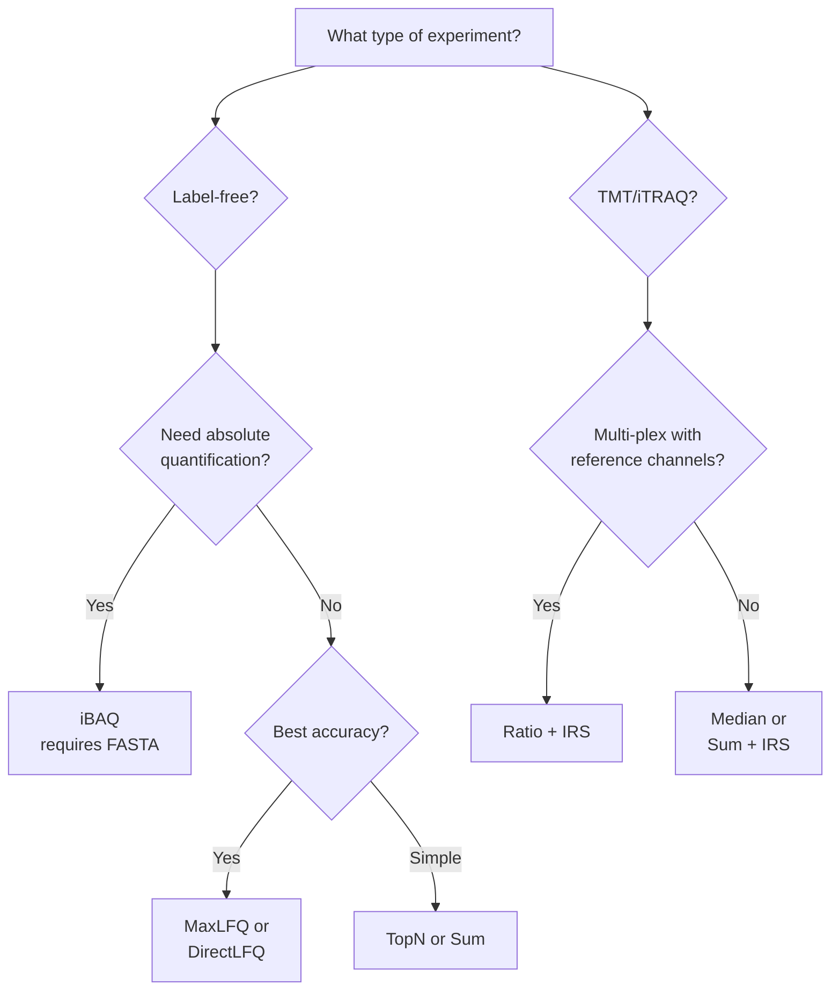

# Quantification Methods

mokume supports multiple protein quantification methods, each suited to different experimental designs and goals.

## Overview

| Method | Description | Requires FASTA | `--quant-method` |
|--------|-------------|:--------------:|------------------|
| **iBAQ** | Intensity-Based Absolute Quantification | Yes | `ibaq` |
| **TopN** | Average of N most intense peptides | No | `topn` / `top3` |
| **MaxLFQ** | Delayed normalization with parallelization | No | `maxlfq` |
| **DirectLFQ** | Intensity traces with hierarchical alignment | No | `directlfq` |
| **Sum** | Sum of all peptide intensities | No | `sum` |
| **Ratio** | Log2 sample/reference per plex (PS protocol) | No | `ratio` |
| **TMT Abundance** | Median of log2 peptide intensities | No | `abd` |
| **TMT Reporter Intensity** | Sum of raw reporter intensities | No | `intensity` |
| **Median** | Median of peptide intensities | No | `median` |
| **Spectral Count** | Count of distinct peptides per (protein, sample) | No | `spectral_count` |

All methods are implemented in the native Rust kernel (no third-party Python
extras). MaxLFQ and DirectLFQ are native Rust ports — DirectLFQ is no longer a
separate Python dependency.

## Choosing a Method



## iBAQ (piBAQ: Paralog-Aware)

**Intensity-Based Absolute Quantification** divides summed peptide intensities by the number of theoretically observable peptides per protein, enabling comparison of absolute protein amounts across proteins within a sample.

$$\text{iBAQ} = \frac{\sum \text{peptide intensities}}{\text{theoretical peptide count}}$$

mokume's default iBAQ implementation is **anchor-gated and family-aware**: peptides are assigned to canonical entries only **unless** an alternative isoform has its own uniquely mappable peptide. The proportional shared-peptide allocation is gpGrouper-style ([Saltzman et al. 2018 *MCP* 17:2270](https://www.mcponline.org/content/17/11/2270)), and the underlying iBAQ definition follows the original [Schwanhäusser et al. 2011 *Nature* 473:337](https://doi.org/10.1038/nature10098) (`sum peptide intensities / theoretical peptide count`). Concretely:

- **Per-protein proportional allocation** (the main path) when every member of a protein family has at least one detected proteotypic peptide. Shared-peptide intensities are split across members weighted by their unique-anchor counts (gpGrouper-style).
- **Family-level rollup fallback** when one or more members have zero detected proteotypic peptides (e.g. the actin family, where Actc1 / Actb / Actg1 share >99% identity). The whole family receives a single iBAQ from the union of family peptide intensities divided by the family-restricted proteotypic peptide count.

Family discovery proceeds in two layers:

1. **UniProt isoform collapse** — accessions of the form `P05067-2`, `P70255-3` are folded onto their canonical entry (`P05067`, `P70255`). This matches the UniProt convention and absorbs the bulk of "non-canonical isoform with no unique peptide" cases.
2. **Shared-peptide connected components** — proteins are grouped into a family when they share at least `min_shared` (default 2) digested peptides. Singleton families are equivalent to the per-protein baseline.

Power users can override either layer via `--families families.yaml`:

```yaml
families:
  - name: ACT
    members: [P60709, P63261, P68133]   # canonical accessions
  - name: HIST_H2A
    members: [P0C0S5, Q96QV6, P04908]
```

iBAQ requires a **FASTA file** to compute theoretical peptide counts via in-silico digestion.

=== "CLI"

    ```bash
    mokume peptides2protein \
        --fasta proteome.fasta \
        --peptides peptides.csv \
        --enzyme Trypsin \
        --normalize \
        --method ibaq \
        --output proteins-ibaq.tsv
    ```

=== "Python (wheel)"

    ```python
    import mokume

    mokume.peptides2protein(
        fasta="proteome.fasta",
        peptides="peptides.csv",
        enzyme="Trypsin",
        normalize=True,
        method="ibaq",
        output="proteins-ibaq.tsv",
    )
    ```

!!! note
    iBAQ enzymes outside the Rust-ported pyOpenMS set (e.g. `CNBr`, or
    context-dependent rules like `proline endopeptidase`) are computed in pure
    Python via `mokume.peptides2protein_ibaq` (`pip install mokume-rs[ibaq]`); the
    kernel errors with a pointer there.

The piBAQ output adds three metadata columns to the per-protein long-format table so users can audit which path each protein took:

| Column | Type | Meaning |
|--------|------|---------|
| `FamilyId` | string | Canonical accession of the family representative (largest digested-peptide set) |
| `FamilySize` | int | Number of canonical members in the family (1 = singleton, isolated protein) |
| `EvidenceLevel` | enum | `high` (≥3 unique anchors) / `medium` (1-2 anchors) / `family_only` (zero anchors → fallback aggregation triggered) |

When `EvidenceLevel == "family_only"`, every member of the family carries the same iBAQ value — member-level resolution was not identifiable from the data.

Additional iBAQ-derived values:

| Value | Formula | Use Case |
|-------|---------|----------|
| IbaqNorm | iBAQ / sum(iBAQ) per sample | Relative comparison |
| IbaqLog | 10 + log10(IbaqNorm) | Visualization |
| TPA | NormIntensity / MW | Total Protein Approach |
| CopyNumber | From ProteomicRuler | Absolute copy numbers |

For TPA mode the molecular weight follows the same family-aware rule: per-protein MW for the proportional branch, sum of family MWs for the rollup fallback (so the family-level TPA matches the family-level iBAQ semantics).

## TopN

Averages the **N most intense peptides** per protein per sample. Top3 is the most common choice (based on the Top3 method by Silva et al.), but any N is supported via `--topn`.

```bash
mokume features2proteins -p features.parquet -o proteins.csv \
    --quant-method topn --topn 3
```

!!! tip
    Top3 is a good default for label-free experiments when you don't need absolute quantification.

## MaxLFQ

The **MaxLFQ algorithm** (Cox et al., 2014) uses delayed normalization with pairwise peptide ratios to estimate protein intensities. It's particularly robust to missing values.

In the native Rust kernel, MaxLFQ rolls the peptide matrix up with the DirectLFQ estimator (delegating with `min_nonan = 2`). It is real-data compatibility-checked against frozen Python-generated output — cell-exact on PXD003539 within the f32 tolerance tier.

```bash
mokume features2proteins -p features.parquet -o proteins.csv \
    --quant-method maxlfq
```

## DirectLFQ

**DirectLFQ** (Ammar et al., 2023) uses hierarchical normalization with variance-guided pairwise alignment. When used as the quantification method, it handles both normalization and quantification. It is a native Rust port of the DirectLFQ estimator — no separate Python dependency is needed.

!!! note
    When `--quant-method directlfq` is selected, the kernel handles **all processing** through the DirectLFQ estimator. Run and sample normalization settings are ignored.

```bash
mokume features2proteins \
    -p features.parquet -o proteins.csv \
    --quant-method directlfq
```

## Sum (All Peptides)

Simply sums all peptide intensities per protein per sample. The simplest approach, useful as a baseline.

## Ratio (PS Protocol)

For **multi-plex TMT experiments with reference channels**, the ratio method computes log2(sample/reference) per PSM per plex, then aggregates to protein level via median.

```text
PSM intensities → average fractions → divide by reference → log2
→ median by peptide → median by protein → wide matrix
```

This method requires an SDRF file to detect reference samples and plexes.

```bash
mokume features2proteins \
    -p features.parquet -o proteins.csv -s experiment.sdrf.tsv \
    --quant-method ratio \
    --coverage-threshold 0.65
```

!!! info
    Ratio quantification handles cross-plex normalization inherently via per-plex reference division. The `--irs` flag is ignored for ratio mode.

## TMT Abundance

The `abd` method computes protein abundance as the **median of log2-transformed peptide intensities** per (protein, sample). Non-positive intensities are treated as missing.

```bash
mokume features2proteins -p features.parquet -o proteins.csv \
    --quant-method abd
```

## TMT Reporter Intensity

The `intensity` method computes protein abundance as the **sum of raw reporter intensities** per (protein, sample) in linear space — no log transform, no aggregation choice.

```bash
mokume features2proteins -p features.parquet -o proteins.csv \
    --quant-method intensity
```

## Spectral Count

The simplest count-based quantification: protein abundance is the number of
distinct peptides (modification-stripped sequences) per (protein, sample).
Useful as a baseline for label-free
workflows and for sanity-checking peptide identification depth across
samples.

```bash
mokume features2proteins -p features.parquet -o proteins.csv \
    --quant-method spectral_count
```

!!! note
    Because the `features2proteins` pipeline aggregates features to the
    canonical peptide before quantification, the count returned here is
    **distinct peptides (modification-stripped sequences) per (protein,
    sample)**, not a raw PSM count. Two peptidoforms of the same sequence
    (e.g. with and without a modification) collapse to one, and both the
    Rust and Python builds produce the same count. Use it as an
    identification-depth indicator rather than as a strict spectral-count
    quantification.

## Standard Output Format

All quantification methods produce a standard `Intensity` column in long format, which the pipeline converts to wide format (proteins x samples) for the final output.
