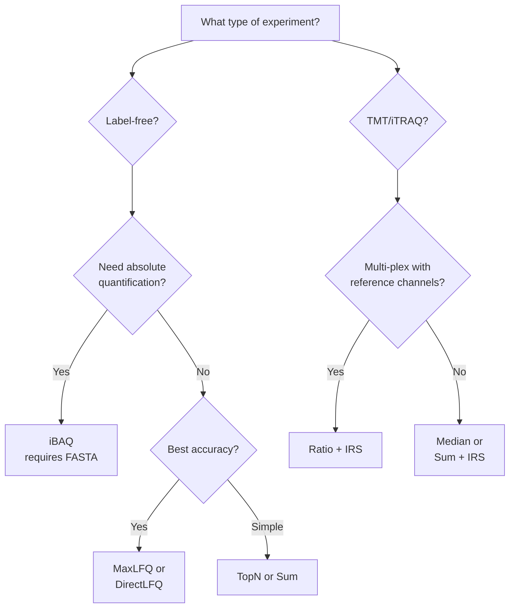

# Quantification Methods

mokume supports multiple protein quantification methods, each suited to different experimental designs and goals.

## Overview

| Method | Description | Requires FASTA | Class | Optional Dep |
|--------|-------------|:--------------:|-------|:------------:|
| **iBAQ** | Intensity-Based Absolute Quantification | Yes | `peptides_to_protein()` | No |
| **TopN** | Average of N most intense peptides | No | `TopNQuantification` | No |
| **MaxLFQ** | Delayed normalization with parallelization | No | `MaxLFQQuantification` | No* |
| **DirectLFQ** | Intensity traces with hierarchical alignment | No | `DirectLFQQuantification` | Yes** |
| **Sum** | Sum of all peptide intensities | No | `AllPeptidesQuantification` | No |
| **Ratio** | Log2 sample/reference per plex (PS protocol) | No | `RatioQuantification` | No |
| **TMT Abundance** | Median of log2 peptide intensities (`abd`) | No | `TMTAbundanceQuantification` | No |
| **TMT Reporter Intensity** | Sum of raw reporter intensities (`intensity`) | No | `TMTReporterIntensityQuantification` | No |
| **Median** | Median of peptide intensities | No | Built-in | No |

\* MaxLFQ automatically uses DirectLFQ when installed for best accuracy, falling back to built-in implementation otherwise.

\** DirectLFQ requires: `pip install mokume[directlfq]`

## Choosing a Method



## iBAQ

**Intensity-Based Absolute Quantification** divides summed peptide intensities by the number of theoretically observable peptides, enabling comparison of absolute protein amounts across proteins within a sample.

$$\text{iBAQ} = \frac{\sum \text{peptide intensities}}{\text{theoretical peptide count}}$$

iBAQ requires a **FASTA file** to compute theoretical peptide counts via in-silico digestion.

```python
from mokume.quantification import peptides_to_protein

peptides_to_protein(
    fasta="proteome.fasta",
    peptides="peptides.csv",
    enzyme="Trypsin",
    normalize=True,
    output="proteins-ibaq.tsv",
)
```

Additional iBAQ-derived values:

| Value | Formula | Use Case |
|-------|---------|----------|
| IbaqNorm | iBAQ / sum(iBAQ) per sample | Relative comparison |
| IbaqLog | 10 + log10(IbaqNorm) | Visualization |
| TPA | NormIntensity / MW | Total Protein Approach |
| CopyNumber | From ProteomicRuler | Absolute copy numbers |

## TopN

Averages the **N most intense peptides** per protein per sample. Top3 is the most common choice (based on the Top3 method by Silva et al.), but any N is supported.

```python
from mokume.quantification import TopNQuantification

top3 = TopNQuantification(n=3)
result = top3.quantify(peptides)

# Also: top5, top10, etc.
top10 = TopNQuantification(n=10)
```

!!! tip
    Top3 is a good default for label-free experiments when you don't need absolute quantification.

## MaxLFQ

The **MaxLFQ algorithm** (Cox et al., 2014) uses delayed normalization with pairwise peptide ratios to estimate protein intensities. It's particularly robust to missing values.

mokume provides two implementations:

1. **DirectLFQ backend** (default when installed) — variance-guided pairwise alignment from the DirectLFQ package
2. **Built-in fallback** — parallelized peptide trace alignment achieving ~0.95 Spearman correlation with DIA-NN's MaxLFQ

```python
from mokume.quantification import MaxLFQQuantification

maxlfq = MaxLFQQuantification(
    min_peptides=2,    # Min peptides for MaxLFQ (uses median for fewer)
    threads=4,         # Parallel cores (-1 for all)
)
result = maxlfq.quantify(peptides)

# Check which backend is active
print(maxlfq.using_directlfq)  # True/False
print(maxlfq.name)             # "MaxLFQ (DirectLFQ)" or "MaxLFQ (built-in)"
```

## DirectLFQ

**DirectLFQ** (Ammar et al., 2023) uses hierarchical normalization with variance-guided pairwise alignment. When used as the quantification method, it handles both normalization and quantification.

!!! note
    When `--quant-method directlfq` is selected, mokume delegates **all processing** to the DirectLFQ package. Run and sample normalization settings are ignored.

```bash
pip install mokume[directlfq]

mokume features2proteins \
    -p features.parquet -o proteins.csv \
    --quant-method directlfq
```

## Sum (All Peptides)

Simply sums all peptide intensities per protein per sample. The simplest approach, useful as a baseline.

## Ratio (PS Protocol)

For **multi-plex TMT experiments with reference channels**, the ratio method computes log2(sample/reference) per PSM per plex, then aggregates to protein level via median.

```
PSM intensities → average fractions → divide by reference → log2
→ median by peptide → median by protein → wide matrix
```

This method requires an SDRF file to detect reference samples and plexes.

```bash
mokume features2proteins \
    -p features.parquet -o proteins.csv -s experiment.sdrf.tsv \
    --quant-method ratio \
    --coverage-threshold 0.65
```

!!! info
    Ratio quantification handles cross-plex normalization inherently via per-plex reference division. The `--irs` flag is ignored for ratio mode.

## TMT Abundance

The `abd` method computes protein abundance as the **median of log2-transformed peptide intensities** per (protein, sample). Non-positive intensities are treated as missing.

```python
from mokume.quantification import TMTAbundanceQuantification

abd = TMTAbundanceQuantification()
result = abd.quantify(peptides, intensity_column="NormIntensity")
```

Or via the factory:

```python
from mokume.quantification import get_quantification_method

abd = get_quantification_method("abd")  # also "abundance"
```

## TMT Reporter Intensity

The `intensity` method computes protein abundance as the **sum of raw reporter intensities** per (protein, sample) in linear space — no log transform, no aggregation choice.

```python
from mokume.quantification import TMTReporterIntensityQuantification

reporter = TMTReporterIntensityQuantification()
result = reporter.quantify(peptides, intensity_column="NormIntensity")
```

Or via the factory:

```python
from mokume.quantification import get_quantification_method

reporter = get_quantification_method("intensity")  # also "reporter"
```

## Standard Output Format

All quantification methods produce a standard `Intensity` column in long format, which the pipeline converts to wide format (proteins x samples) for the final output.
