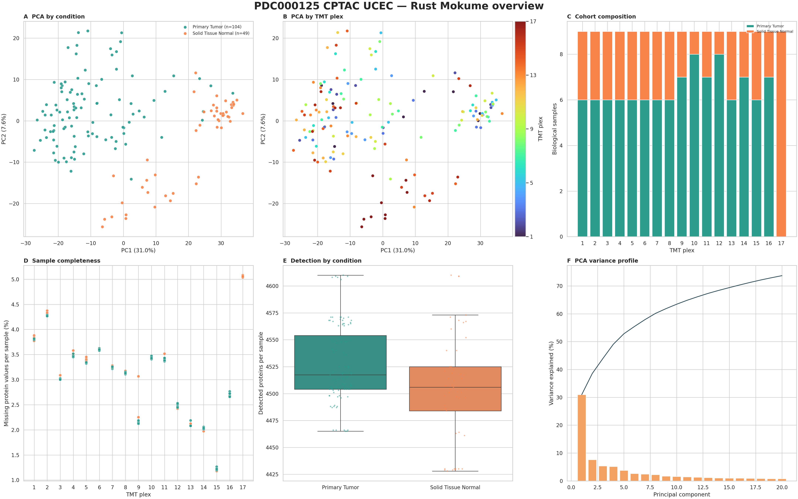
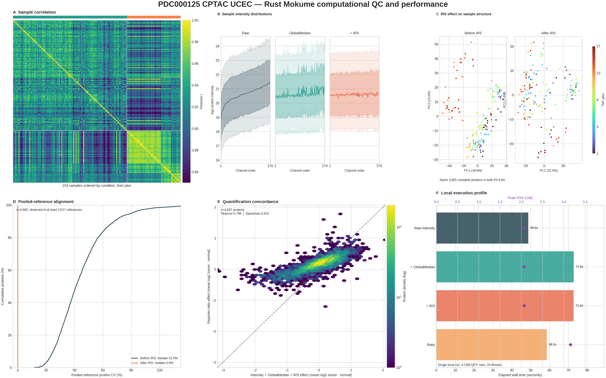
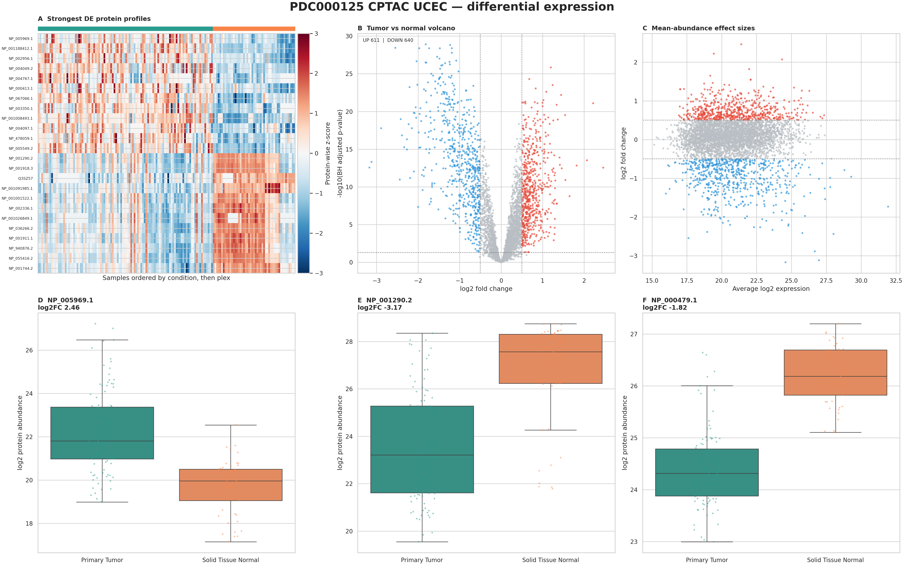

# CPTAC UCEC total proteome

This full-size example processes the
[PDC000125 CPTAC UCEC Discovery proteome](https://pdc.cancer.gov/pdc/study/PDC000125):
4,131,391 QPX feature rows from 408 fractionated runs in 17 TMT10 plexes. The
metadata helper queries the official PDC `studyExperimentalDesign` and
`biospecimenPerStudy` APIs, joins their aliquot assignments to the QPX runs,
and validates every run/channel pair before writing an analysis SDRF.

The source data are not committed to this repository. Set `CPTAC_ROOT` to the
root of a local CPTAC archive that contains the PDC000125 QPX export.

## Install the runtime

The helper needs PyArrow to read the QPX run column and Requests to query PDC.
The plotting extra renders the final Mokume outputs.

```bash
python -m pip install "mokume[plotting]" pyarrow requests
```

## Build the analysis SDRF

```bash
export CPTAC_ROOT=/path/to/CPTAC
export CPTAC_OUT=/tmp/mokume-cptac-ucec
export CPTAC_QPX="$CPTAC_ROOT/stage2/PDC000125/qpx/cdap.feature.parquet"

mkdir -p "$CPTAC_OUT"
python docs/examples/prepare_cptac_ucec.py \
    "$CPTAC_QPX" \
    "$CPTAC_OUT/PDC000125.sdrf.tsv" \
    --threads 24
```

The helper writes 4,080 SDRF records: 17 plexes × 24 fractions × 10 channels.
The 170 channel-level samples comprise 104 primary tumors, 49 solid-tissue
normals, and 17 pooled references. It also verifies that the PDC fraction count,
TMT assignments, and all 408 QPX run names agree.

## Quantify, normalize, and test

```bash
mokume features2proteins \
    --parquet "$CPTAC_QPX" \
    --sdrf "$CPTAC_OUT/PDC000125.sdrf.tsv" \
    --output "$CPTAC_OUT/PDC000125.proteins.csv" \
    --quant-method intensity \
    --run-normalization none \
    --sample-normalization globalmedian \
    --irs \
    --irs-remove-reference \
    --coverage-threshold 0.65 \
    --de \
    --de-contrasts "Primary Tumor vs Solid Tissue Normal" \
    --de-method limma \
    --de-log2fc 0.5 \
    --de-fdr 0.05 \
    --de-fdr-method bh \
    --de-output "$CPTAC_OUT/PDC000125.primary-tumor-vs-normal.csv" \
    --threads 24
```

`intensity` produces linear summed reporter abundance. Global-median
normalization corrects sample-wide reporter loading shifts, then IRS aligns the
17 plexes through their pooled channels and removes those references from the
matrix. The 65% condition-wise coverage gate keeps a protein only when it is
observed in at least 69 of 104 tumors and 32 of 49 normals. `ratio` is also a
valid TMT quantification method, but its output is already
log2(sample/reference); this example intentionally keeps a linear matrix for
the downstream DE and plotting interfaces.

## Render the figures

```bash
OMP_NUM_THREADS=24 OPENBLAS_NUM_THREADS=24 MKL_NUM_THREADS=24 \
MPLCONFIGDIR="$CPTAC_OUT/matplotlib" \
python -m mokume.commands.de_plots \
    --protein-matrix "$CPTAC_OUT/PDC000125.proteins.csv" \
    --plot-dir "$CPTAC_OUT/plots" \
    --sdrf "$CPTAC_OUT/PDC000125.sdrf.tsv" \
    --volcano \
    --pca \
    --irs-remove-reference \
    --log2fc-threshold 0.5 \
    --fdr-threshold 0.05 \
    --contrast PDC000125-UCEC \
        "Primary Tumor" \
        "Solid Tissue Normal" \
        "$CPTAC_OUT/PDC000125.primary-tumor-vs-normal.csv"

OMP_NUM_THREADS=24 OPENBLAS_NUM_THREADS=24 MKL_NUM_THREADS=24 \
MPLCONFIGDIR="$CPTAC_OUT/matplotlib" \
python docs/examples/render_cptac_ucec.py \
    "$CPTAC_OUT/PDC000125.proteins.csv" \
    "$CPTAC_OUT/PDC000125.sdrf.tsv" \
    "$CPTAC_OUT/PDC000125.primary-tumor-vs-normal.csv" \
    "$CPTAC_OUT/showcase" \
    --threads 24
```

The first command retains the standalone Mokume PCA and volcano files. The
example renderer writes matching overview and biological six-panel composites
without recomputing either the protein matrix or differential expression.

## Render computational QC and performance

Run the same native kernel without the final coverage gate to retain the common
protein and pooled-reference axes needed by the computational-QC panels. GNU
`time` writes one comma-separated record per workflow: workflow name, elapsed
seconds, and peak RSS in KiB.

```bash
export CPTAC_PERF="$CPTAC_OUT/performance"
export RAYON_NUM_THREADS=24
export OMP_NUM_THREADS=24
export OPENBLAS_NUM_THREADS=24
export MKL_NUM_THREADS=24
mkdir -p "$CPTAC_PERF"

/usr/bin/time -f "raw_intensity,%e,%M" \
    -o "$CPTAC_PERF/raw_intensity.time" \
    mokume features2proteins \
    --parquet "$CPTAC_QPX" \
    --sdrf "$CPTAC_OUT/PDC000125.sdrf.tsv" \
    --output "$CPTAC_PERF/PDC000125.intensity.raw.csv" \
    --quant-method intensity \
    --run-normalization none \
    --sample-normalization none \
    --threads 24

/usr/bin/time -f "globalmedian,%e,%M" \
    -o "$CPTAC_PERF/globalmedian.time" \
    mokume features2proteins \
    --parquet "$CPTAC_QPX" \
    --sdrf "$CPTAC_OUT/PDC000125.sdrf.tsv" \
    --output "$CPTAC_PERF/PDC000125.intensity.globalmedian.csv" \
    --quant-method intensity \
    --run-normalization none \
    --sample-normalization globalmedian \
    --threads 24

/usr/bin/time -f "globalmedian_irs,%e,%M" \
    -o "$CPTAC_PERF/globalmedian_irs.time" \
    mokume features2proteins \
    --parquet "$CPTAC_QPX" \
    --sdrf "$CPTAC_OUT/PDC000125.sdrf.tsv" \
    --output "$CPTAC_PERF/PDC000125.intensity.globalmedian-irs.csv" \
    --quant-method intensity \
    --run-normalization none \
    --sample-normalization globalmedian \
    --irs \
    --threads 24

/usr/bin/time -f "ratio,%e,%M" \
    -o "$CPTAC_PERF/ratio.time" \
    mokume features2proteins \
    --parquet "$CPTAC_QPX" \
    --sdrf "$CPTAC_OUT/PDC000125.sdrf.tsv" \
    --output "$CPTAC_PERF/PDC000125.ratio.csv" \
    --quant-method ratio \
    --run-normalization none \
    --sample-normalization none \
    --ratio-fraction-merge mean \
    --threads 24

MPLCONFIGDIR="$CPTAC_OUT/matplotlib" \
python docs/examples/render_cptac_performance.py \
    "$CPTAC_OUT/PDC000125.proteins.csv" \
    "$CPTAC_PERF/PDC000125.intensity.raw.csv" \
    "$CPTAC_PERF/PDC000125.intensity.globalmedian.csv" \
    "$CPTAC_PERF/PDC000125.intensity.globalmedian-irs.csv" \
    "$CPTAC_PERF/PDC000125.ratio.csv" \
    "$CPTAC_OUT/PDC000125.sdrf.tsv" \
    "$CPTAC_PERF" \
    "$CPTAC_OUT/showcase/cptac_ucec_performance.png" \
    --threads 24
```

The renderer fails if matrix axes disagree or if the retained-reference IRS
matrix is not numerically consistent with the coverage-filtered final matrix.
It treats zero as missing only for the linear intensity matrices; zero remains
a valid log2 ratio.

## Reproduced result

The coverage-filtered matrix contains 4,665 proteins across all 153 biological
samples. Under Mokume's linear-input contract, 3.10% of its cells are missing.
The DE result contains 611 up-regulated, 640 down-regulated, and 3,414 unchanged
proteins at BH FDR < 0.05 and |log2FC| > 0.5.



*Top row: PCA coloured by condition, the same PCA coloured by TMT plex, and
cohort composition across plexes. Bottom row: per-sample completeness, detected
proteins by condition, and the PCA variance profile. PC1 explains 31.0% and PC2
explains 7.6% of the variance.*



*Top row: sample correlation, the stepwise intensity-distribution trajectory,
and PCA before and after IRS. Bottom row: pooled-reference protein CV,
intensity-versus-ratio tumor/normal effect concordance, and the local execution
profile. The independent Rust quantification paths share 4,647 protein effects
(Pearson 0.786; Spearman 0.810). The pooled-reference median CV changes from
41.0% to numerical zero because those channels are the IRS scaling anchors,
not an independent validation set.*

On the workstation used to render this figure (Intel Core Ultra 7 270K Plus,
24 hardware threads, 125 GiB RAM), the four single runs took 48.76–72.80
seconds with 2.05–3.16 GiB peak RSS. These measurements document this exact
run; they are not a portable hardware benchmark.



*Top row: protein-wise z-scores for the strongest positive and negative
effects, limma volcano, and MA plot. Bottom row: observed expression for three
representative DE proteins. Every panel reads the Rust-written matrix or DE
table.*

Plex 17 contains nine solid-tissue normals and no tumors, and contributes
strongly to the lower PC2 branch. Because that plex has no within-plex tumor
comparison, the example leaves this design limitation visible instead of
selecting a batch-correction method from the PCA appearance alone. The volcano
uses dashed lines for |log2FC| = 0.5 and BH FDR = 0.05; the heatmap orders
samples by condition and then plex so this design structure stays visible.

As a numerical cross-check, every reported `log2FC` was independently
recomputed from the written linear matrix after replacing non-positive cells
with missing values. The maximum absolute difference across all 4,665 proteins
was `3.2e-14`, and every per-protein sample count matched the matrix exactly.

## Data citation

Use PDC study identifier [PDC000125](https://pdc.cancer.gov/pdc/study/PDC000125)
and cite Dou et al.,
[“Proteogenomic Characterization of Endometrial Carcinoma”](https://doi.org/10.1016/j.cell.2020.01.026).
For publications, PDC also requests the statement: “Data used in this
publication were generated by the National Cancer Institute Clinical Proteomic
Tumor Analysis Consortium (CPTAC).”
