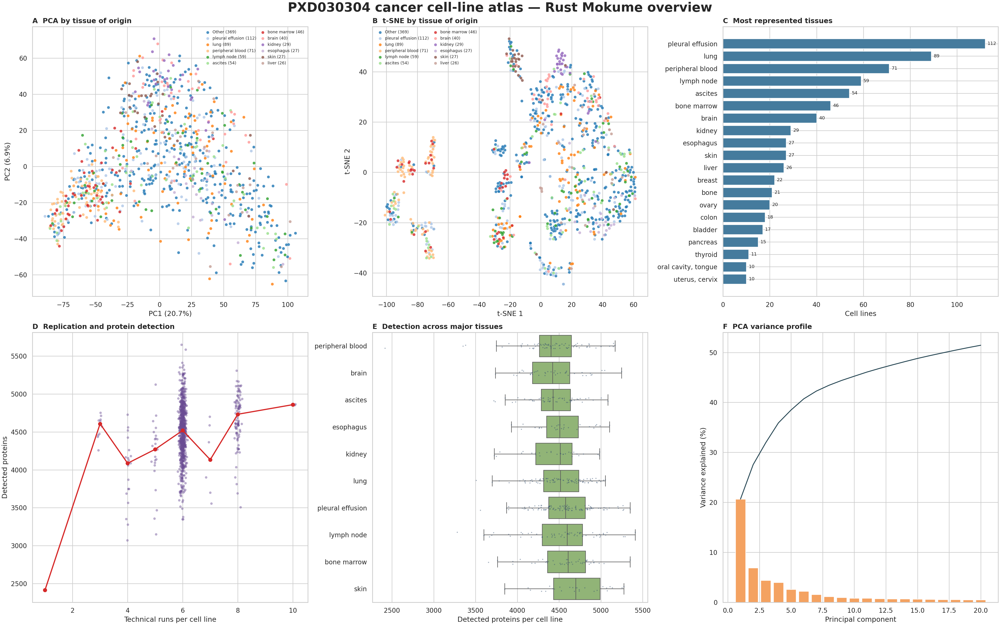
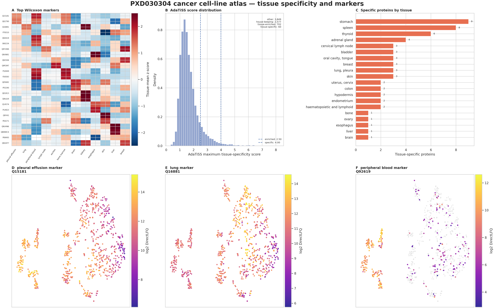

# PXD030304 cancer cell-line atlas

This full-size example starts from the local QPX export for **PXD030304**:
178,453,153 DIA-NN feature rows from 5,798 label-free runs representing 949
cancer cell lines. The native Rust kernel builds one DirectLFQ protein matrix;
the Python periphery then reads that matrix to render the atlas, marker, and
tissue-specificity panels. The plotting step does not re-quantify the data.

The source data are not committed to this repository. Set `CELL_LINE_ROOT` to a
local PXD030304 directory containing the QPX feature table and its SDRF.

## Install the runtime

```bash
python -m pip install "mokume[tissuemap]"
```

## Build the Rust DirectLFQ matrix

```bash
export CELL_LINE_ROOT=/path/to/PXD030304
export CELL_LINE_OUT=/tmp/mokume-pxd030304
export CELL_LINE_QPX="$CELL_LINE_ROOT/qpx/PXD030304.feature.parquet"
export CELL_LINE_SDRF="$CELL_LINE_ROOT/mokume/sdrf/PXD030304.sdrf.tsv"

mkdir -p "$CELL_LINE_OUT"
RAYON_NUM_THREADS=24 mokume features2proteins \
    --parquet "$CELL_LINE_QPX" \
    --sdrf "$CELL_LINE_SDRF" \
    --output "$CELL_LINE_OUT/PXD030304.directlfq.csv" \
    --quant-method directlfq \
    --run-normalization none \
    --sample-normalization none \
    --threads 24
```

DirectLFQ performs its own peptide-profile alignment and protein summarization.
The two `none` options mean that no additional run-level or sample-level
normalization is layered onto that result.

## Render the complete showcase

```bash
OMP_NUM_THREADS=24 OPENBLAS_NUM_THREADS=24 MKL_NUM_THREADS=24 \
NUMEXPR_NUM_THREADS=24 MPLCONFIGDIR="$CELL_LINE_OUT/matplotlib" \
python docs/examples/render_pxd030304.py \
    "$CELL_LINE_OUT/PXD030304.directlfq.csv" \
    "$CELL_LINE_SDRF" \
    "$CELL_LINE_OUT/showcase" \
    --threads 24 \
    --min-tissue-samples 5
```

The renderer changes positive DirectLFQ values to log2 scale, retains proteins
observed in at least 5% of the 949 cell lines, applies MinDet only for the
PCA/t-SNE embedding, and fixes the random seed at 42. All 949 cell lines enter
the overview. Marker testing and AdaTiSS use the 790 cell lines in the 30
tissues with at least five samples, so singleton and very small tissue groups
cannot drive the biological panels.

## Reproduced result

The Rust run accepted 163,871,510 feature measurements and wrote an 8,930 × 949
protein matrix. Treating its zero sentinel as missing gives 49.56% missing
cells. The visualization filter retains 7,188 proteins; PC1 explains 20.7% and
PC2 6.9% of the variance.



*PCA and t-SNE for all 949 cell lines, tissue representation, technical-run
depth versus protein detection, detection distributions for the major tissues,
and the PCA variance profile.*



*Wilcoxon marker profiles, the AdaTiSS distribution, tissue-specific protein
counts, and three marker-expression maps. Across the 30 adequately represented
tissues, AdaTiSS classifies 62 proteins as tissue-specific, 712 as
tissue-enriched, 2,552 as housekeeping, and 3,862 as other.*

## Numerical cross-check against the previous run

The previous DirectLFQ table was used only after the new Rust run completed; it
was never an input to the new matrix or figures. Both tables have the same
8,930 proteins and 949 samples. Across 4,274,308 cells positive in both tables,
the log2 Pearson correlation is 0.999121 and the Spearman correlation is
0.999077, with a median log2 offset of 0. Detection status agrees for 99.99935%
of all 8,474,570 protein-sample cells; the 55 disagreements are old-positive,
new-zero cells spanning 22 proteins and 53 samples.

The previous MaxLFQ table is a different quantification method and is therefore
not expected to match cell by cell. On their shared positive values, its log2
correlation with the new DirectLFQ matrix is 0.9803. These checks show no global
scale, sample-order, protein-order, or detection-pattern failure in the new
Rust result; they do not claim bit-for-bit identity between implementations.
