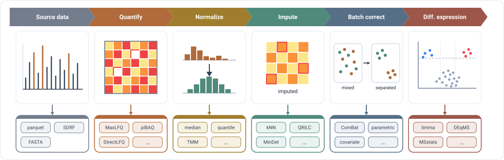

# Quick Start

This guide shows how to go from raw feature data to protein intensities using mokume.

{ width="100%" }

## Prerequisites

You need:

1. A **parquet file** in quantms.io/qpx format (output from quantms pipeline)
2. Optionally, an **SDRF file** for sample metadata

For most workflows, `pip install mokume-rs` is enough. The wheel runs the Rust
compute kernel in-process; you can also use the standalone `mokume` CLI binary
(built from `rust/crates/mokume-cli` with cargo, no Python). If you want the
TissueMap periphery command from the wheel, install `mokume-rs[tissuemap]`.

!!! warning "`mokume-rs` is not on PyPI yet"
    `pip install mokume-rs` does not work yet — the Rust wheel is unreleased. Use
    `pip install mokume` (pure Python, with the same import name but a separately
    maintained API) or build the wheel from `rust/`; see
    [Installation](installation.md).

## One-Step Pipeline (Recommended)

The `features2proteins` command handles everything: loading, filtering, normalization, and quantification.

=== "CLI"

    ```bash
    # MaxLFQ quantification (default)
    mokume features2proteins \
        -p features.parquet \
        -o proteins.csv \
        -s experiment.sdrf.tsv

    # With TMT IRS normalization + differential expression
    # (the kernel writes one DE result CSV per contrast via --de-output)
    mokume features2proteins \
        -p features.parquet \
        -o proteins.csv \
        -s experiment.sdrf.tsv \
        --quant-method median \
        --irs --irs-remove-reference \
        --de --de-contrasts "NASH-HL" \
        --de-output de_results.csv

    # DirectLFQ (native Rust)
    mokume features2proteins \
        -p features.parquet \
        -o proteins.csv \
        --quant-method directlfq

    # iBAQ (requires FASTA)
    mokume features2proteins \
        -p features.parquet \
        -o proteins.csv \
        --quant-method ibaq \
        --fasta proteome.fasta
    ```

=== "Python (wheel)"

    ```python
    import mokume

    # The wheel runs the same Rust kernel in-process (no subprocess); kwargs map
    # to CLI flags (key=value -> --key value, key=True -> --key, a list repeats
    # the flag, with _ rewritten to -).

    # Simple MaxLFQ
    mokume.features2proteins(
        parquet="features.parquet",
        output="proteins.csv",
        sdrf="experiment.sdrf.tsv",
        quant_method="maxlfq",
    )

    # TMT with IRS + DE
    mokume.features2proteins(
        parquet="features.parquet",
        output="proteins.csv",
        sdrf="experiment.sdrf.tsv",
        quant_method="median",
        irs=True,
        irs_remove_reference=True,
        de=True,
        de_contrasts=["NASH-HL"],
        de_output="de_results.csv",
    )
    ```

=== "Python (package)"

    The pure-Python `mokume` package (`pip install ./python`) exposes a
    class-based API. Build a `PipelineConfig`, run it, and read the protein
    matrix off the returned `QpxDataset`:

    ```python
    from mokume.pipeline.config import PipelineConfig, InputConfig, QuantificationConfig
    from mokume.pipeline.runner import run_pipeline

    config = PipelineConfig(
        input=InputConfig(
            parquet="features.parquet",
            sdrf="experiment.sdrf.tsv",
        ),
        quantification=QuantificationConfig(method="maxlfq"),
    )
    dataset = run_pipeline(config)                    # QpxDataset with .proteins populated
    protein_matrix = dataset.get_level("proteins")   # protein x sample DataFrame
    ```

    See [Python API (package)](reference/python-api-package.md) for the full
    OOP surface (`QpxDataset`, backend selection, the plugin registry).

!!! note "Plots and reports are periphery commands"

    `features2proteins` no longer accepts `--plot-*` / `--interactive-report`
    flags — the kernel is pure-compute and only writes tables (the protein matrix
    and, with `--de-output`, the DE result CSVs). Render figures afterward from
    those tables with the Python periphery: `mokume.de_plots([...])` for volcano /
    PCA / heatmap plots and `mokume.interactive_report([...])` for the HTML report
    (both need the `plotting` / `reports` extras).

## Two-Step Pipeline

For more control, use the peptide normalization step separately:

```bash
# Step 1: Normalize peptides
mokume features2peptides \
    -p features.parquet \
    -s experiment.sdrf.tsv \
    --run-normalization median \
    --sample-normalization globalMedian \
    --output peptides.csv

# Step 2: Quantify proteins
mokume peptides2protein \
    --method maxlfq \
    -p peptides.csv \
    -o proteins.tsv
```

## Tissue Atlas Workflow

Use `tissuemap` when your goal is tissue atlas analysis rather than standard
protein quantification. TissueMap is a Python periphery command (not a kernel
subcommand) and lives only in the wheel:

```python
import mokume

# Install the optional dependencies first: pip install mokume-rs[tissuemap]
mokume.tissuemap(
    scan_dir="QPX_data/tissues-mq/PXD016999",
    output_dir="./tissuemap_results",
)
```

This workflow generates batch-corrected AnnData outputs, tissue-specificity scores, and atlas-style plots.

## What's Next?

- [Quantification Methods](concepts/quantification.md) — understand iBAQ, MaxLFQ, TopN, and more
- [Normalization](concepts/normalization.md) — learn about the normalization pipeline
- [Unified Pipeline](user-guide/features2proteins.md) — full reference for features2proteins
- [Tissue Proteome Atlas](periphery/tissuemap.md) — run the per-dataset TissueMap periphery command
